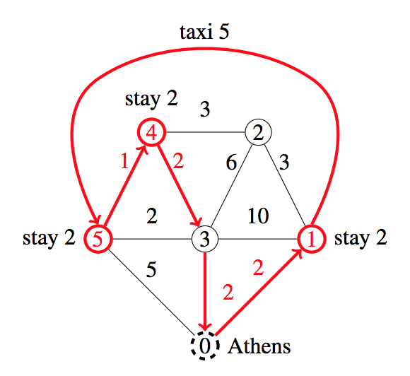

## 문제

For a long time Tim wanted to visit Greece. He has already purchased his flight to and from Athens. Tim has a list of historical sites he wants to visit, e.g., Olympia and Delphi. However, due to recent political events in Greece, the public transport has gotten a little complicated. To make the Greek happy and content with their new government, many short-range bus and train lines have been created. They shall take the citizens around in their neighborhoods, to work or to their doctor. At the same time, long-range trains that are perfect for tourists have been closed down as they are too expensive. This is bad for people like Tim, who really likes to travel by train. Moreover, he has already purchased the Greece’ Card for Public Conveyance (GCPC) making all trains and buses free for him.

Figure A.1: Visual representation of the Sample Input: Tim’s tour has length 18.

Despite his preferred railway lines being closed down, he still wants to make his travel trough Greece. But taking all these local bus and train connections is slower than expected, so he wants to know whether he can still visit all his favorite sites in the timeframe given by his flights. He knows his schedule will be tight, but he has some emergency money to buy a single ticket for a special Greek taxi service. It promises to bring you from any point in Greece to any other in a certain amount of time.

For simplicity we assume, that Tim does never have to wait for the next bus or train at a station. Tell Tim, whether he can still visit all sites and if so, whether he needs to use this taxi ticket.

## 입력

The first line contains five integers N, P, M, G and T, where N denotes the number of places in Greece, P the number of sites Tim wants to visit, M the number of connections, G the total amount of time Tim can spend in Greece, and T the time the taxi ride takes (1 ≤ N ≤ 2·104; 1 ≤ P ≤ 15; 1 ≤ M, G ≤ 105; 1 ≤ T ≤ 500).

Then follow P lines, each with two integers pi and ti, specifying the places Tim wants to visit and the time Tim spends at each site (0 ≤ pi < N; 1 ≤ ti ≤ 500). The sites pi are distinct from each other.

Then follow M lines, each describing one connection by three integers si, di and ti, where si and di specify the start and destination of the connection and ti the amount of time it takes (0 ≤ si, di < N; 1 ≤ ti ≤ 500).

All connections are bi-directional. Tim’s journey starts and ends in Athens, which is always the place 0.

## 출력

Print either “impossible”, if Tim cannot visit all sites in time, “possible without taxi”, if he can visit all sites without his taxi ticket, or “possible with taxi”, if he needs the taxi ticket.
