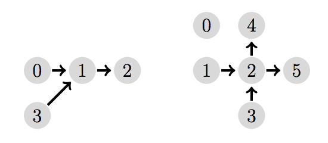

## 문제

aSpike the bounty hunter is tracking another criminal through space. Luckily for him hyperspace travel has made the task of visiting several planets a lot easier. Each planet has a number of Astral Gates; each gate connects with a gate on another planet. These hyperspace connections are, for obvious safety reasons, one-way only with one gate being the entry point and the other gate being the exit point from hyperspace. Furthermore, the network of hyperspace connections must be loop-free to prevent the Astral Gates from exploding, a tragic lesson learned in the gate accident of 2022 that destroyed most of the moon.

While looking at his star map Spike wonders how many friends he needs to conduct a search on every planet. Each planet should not be visited by more than one friend otherwise the criminal might get suspicious and flee before he can be captured. While each person can start at a planet of their choosing and travel along the hyperspace connections from planet to planet they are still bound by the limitations of hyperspace travel.

Figure B.1: Illustration of the Sample Inputs.

## 입력

The input begins with an integer N specifying the number of planets (0 < N ≤ 1000). The planets are numbered from 0 to N −1. The following N lines specify the hyperspace connections. The i-th of those lines first contains the count of connections K (0 ≤ K ≤ N −1) from planet i followed by K integers specifying the destination planets.

## 출력

Output the minimum number of persons needed to visit every planet.
