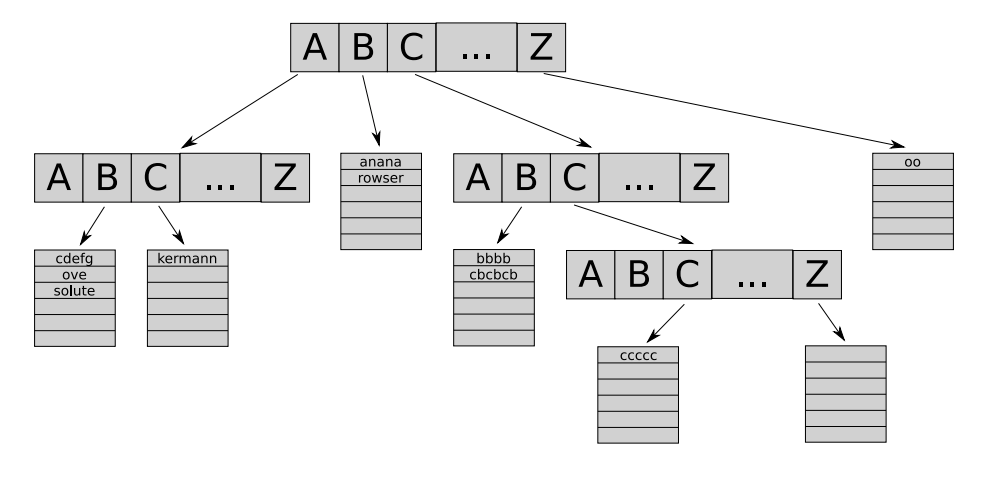

## 문제

John likes sorting algorithms very much. He has studied quicksort, merge sort, radix sort, and many more.

A long time ago he has written a lock-free parallel string sorting program. It was a combination of burstsort and multi-key quicksort. To implement burstsort you need to build a tree of buckets. For each input string you walk through the tree and insert part of the string into the right bucket. When a bucket fills up, it "bursts" and becomes a new subtree (with new buckets).



Figure G.1: Burstsort data structure

Well, enough about the past. Today John is playing with sorting algorithms again. This time it’s numbers. He has an idea for a new algorithm, “extreme sort”. It’s extremely fast, performance levels are OVER NINETHOUSAND. Before he tells anyone any details, he wants to make sure that it works correctly.

Your task is to help him and verify that the so-called extreme property holds after the first phase of the algorithm. The extreme property is defined as min (xi,j) ≥ 0, where

```

xi,j = aj - ai (1 ≤ i < j ≤ N)
     = 9001    (otherwise)
```

## 입력

The first line contains a single integer N (1 ≤ N ≤ 1024). The second line contains N integers a1 a2 . . . aN (1 ≤ ai ≤ 1024).

## 출력

Print one line of output containing “yes” if the extreme property holds for the given input, “no” otherwise.
