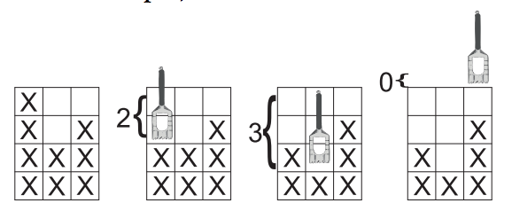

## 문제

A fab lab is an open, small-scale workshop where you can create or fabricate almost anything you want mostly by using computer controlled tools like a laser cutter or a 3D printer. The FAU fab lab recently got a CNC milling machine. Using the milling machine you can cut or remove material with different tools from the surface of a workpiece. It is controlled via a computer program.

I sometimes wondered what happens if multiple different shaped workpieces are sent through the same milling program. For simplification assume that we have only two dimensional workpieces without holes. A milling program consists of multiple steps; each step describes where the milling machine has to remove material (using different tools) from the top of the surface.

## 입력

The first line consists of two integers W and S, where W gives the number of workpieces and S the number of steps in the milling program (1 ≤ W, S ≤ 104). The next line consists of two integers X and Y , where X gives the width and Y gives the maximal possible height of workpieces (1 ≤ X, Y ≤ 100).

Then follow W lines, each describing one workpiece. Each workpiece description consists of X non-negative integers specifying the surface height in that column.

Then follow S lines, each describing one milling step of the milling progam. Each milling step description consists of X non-negative integers si (0 ≤ si ≤ Y ) specifying the amount of surface to cut off in each column (relative to the height of the milling area, i.e. Y , not relative to the top of the workpiece). See Fig. I.1 for details.

## 출력

For each workpiece, output one line containing X integers specifying the remaining surface heights (in the same order as in the input).

Figure I.1: Second workpiece in first sample: initial workpiece followed by milling in each column – the value in the milling program determines the vertical position of the cutter head.
