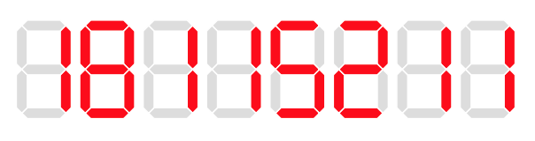
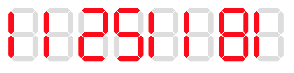

## 문제

어제 자다가 알람 시계를 떨어뜨렸는지, 08:15분이 51:80분이 되어 있었다. 그때 나는 디지털로 표시된 어떤 숫자는 180도 뒤집혔을 때도 숫자가 될 수 있다는 걸 깨달았다.

소수 18115211이 디지털로 표시된 그림

18115211이 180도 뒤집혀서 11251181이 되었다. (소수가 아님)

* , , ,  은 뒤집혀서도 , , ,  그대로이다.
*  은 그냥 왼쪽으로 옮겨진다. 
*  은 가 되고,  는 이 된다.
* , ,  은 더 이상 숫자가 아니다. (, , )

내가 좋아하는 숫자는 소수이다. 당신이 할 일은 주어진 숫자가 소수인지, 뒤집혀서도 소수인지 확인하는 것이다.

## 입력

첫 번째 줄에 N이 주어진다 (1 ≤ N ≤ 1016).

N의 첫 숫자는 0이 아니다.

## 출력

첫 번째 줄에 N이 소수이고 뒤집혀서도 소수이면 "yes"를 출력하고, 아니면 "no"를 출력한다.
