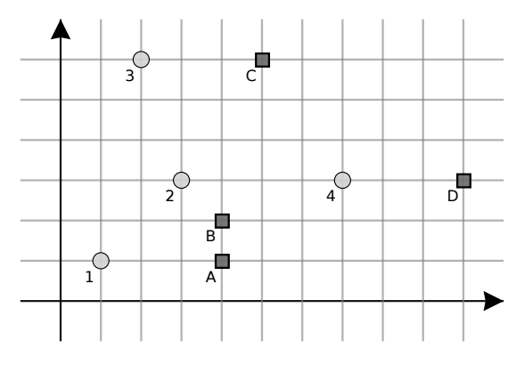

## 문제

Last year, BBQ master Kosta decided to try his luck in Manhattan, where he opened a bunch of restaurants. At first, business was great, but recently a lot of his customers have been taken over by a new fast food chain that doesn’t have the option of eating the food in the restaurant itself (its whereabouts are unknown), but only provides food delivery. Kosta is trying to determine possible locations of the restaurant based on the delivery times in order to begin plotting his revenge.

The streets of Manhattan are parallel to the coordinate axes so the locations of the restaurant and the customers can be described by points in the coordinate plane with integers as coordinates. The distance from point (x1, y1) to point (x2, y2) is equal to |x2 − x1| + |y2 − y1|.

Each time a customer orders food online, immediately the delivery process begins from the closest restaurant (if there are multiple closest restaurants, the delivery takes place from an arbitrary one). The delivery time is equal to the distance from the customer to that closest restaurant.

Kosta asked N of his friends to order food and measure the delivery time. Write a programme that will determine one possible layout of restaurant locations consistent to the given data. If there is more than one layout, output any of them.

## 입력

The first line of input contains the integer N – the number of Kosta’s friends.

Each of the following N lines contains three integers x, y and t separated by a single space that represent a friend located on coordinates (x, y) and whose delivery time is t. All friends are located on different coordinates.

The input data will be such that a solution always exists.

## 출력

The output must contain M lines where M is the number of restaurants in the determined layout.

Each line of output must contain two integers x and y separated by a single space – the coordinates of a restaurant. The number of restaurants M has to be smaller or equal to N, and the coordinates x and y have to be integers from the interval [−109, 109], inclusive.

It is allowed that there are multiple restaurants in the same location in the determined layout.

## 힌트

Clarification of the second example:

If we denote the restaurants from the determined layout with A, B, C and D, then we can see in the image that the restaurant layout corresponds to the gathered data because it holds:

* Restaurant A is closest to friend 1 and delivery time is 3.
* Restaurant B is closest to friend 2 and delivery time is 2.
* Restaurant C is closest to friend 3 and delivery time is 3.
* Restaurant D is closest to friend 4 and delivery time is 3.
