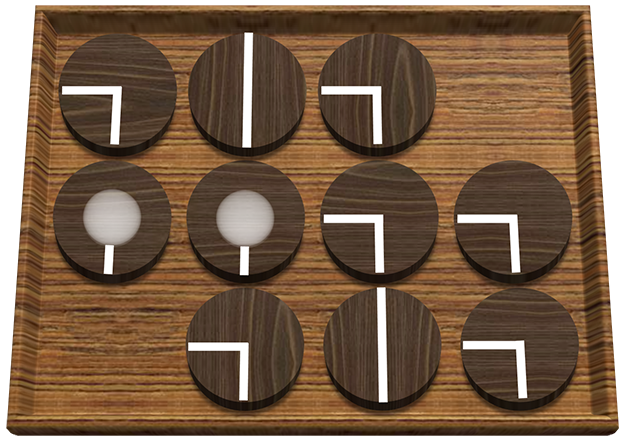
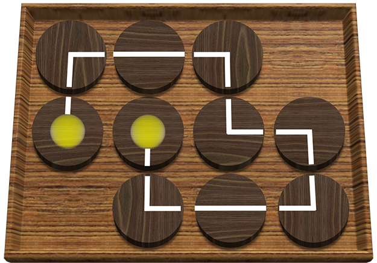

## 문제

Jeehak Yoon is a member of United Committee of Puzzle Creation. Recently, he has made a puzzle to light all the bulbs on the board. The puzzle looks like the following:

The board consists of N rows and M columns of cells. Each cell contains either a bulb, a wire or nothing. There are exactly two bulbs, and each bulb can be connected with an adjacent cell. There are two types of wires in this puzzle: q-type and l-type. A q-type wire connects two cells that share a vertex, and a l-type wire connects two cells that are opposite to each other.

In order to light all the bulbs, they should be connected by wires. (i.e. there must be a path of wires connecting the two bulbs) It can be done by rotating each cell by 90-degree as many times as you want. Jeehak thought this was too easy, so he added one more constraint: all the wires must be used to connect the bulbs. (i.e. the path of wires connecting two bulbs must consist of all the wires in the board)

The figure below shows an example of a valid solution.

Jeehak provided this idea to UCPC and got the test version of this puzzle. He tried to solve the puzzle, but he couldn’t solve it because the size of puzzle was quite large for him. Why don’t you help Jeehak to solve the puzzle?

## 입력

The first line of input contains an integer T (1 ≤ T ≤ 10), the number of test cases.

Each test case starts with a line containing two space-separated integers N and M (1 ≤ N, M ≤ 500), where N is the number of rows of the board and M is the number of columns of the board.

Each of the next N lines contains a string of length M, describing the board. The j-th character of the i-th string (1 ≤ i ≤ N, 1 ≤ j ≤ M) describes the cell in the i-th row from the top and the j-th column from the left. There are four kinds of characters ‘O’ (ASCII code 79), ‘q’ (ASCII code 113), ‘l’ (ASCII code 108), and ‘\*’ (ASCII code 42) which describes a cell: ‘O’ means a bulb, ‘q’ means a q-type wire, ‘l’ means a l-type wire and ‘\*’ means nothing.

## 출력

For each test case,

* If there exists a valid solution, first print “YES” (without quotes) in a single line, and then print how a valid solution looks in the next N lines. The i-th (1 ≤ i ≤ N) line of them should contain exactly M characters. The j-th character of the i-th line (1 ≤ i ≤ N, 1 ≤ j ≤ M) should be determined as follows:
  + If the corresponding cell was a bulb, the character should be one of “^v<>” (ASCII Code 94, 118, 60 and 62, correspondingly), according to the direction (up, down, left and right, correspondingly) to which the bulb is connected.
  + If the corresponding cell was a q-type wire, the character should be one of “qdbp” (ASCII Code 113, 100, 98 and 112, correspondingly), according to the position of two ends (left and down, up and left, right and up, down and right correspondingly) of the wire.
  + If the corresponding cell was a l-type wire, the character should be one of “l-” (ASCII Code 108 and 45, correspondingly), according to the position of two ends (up and down, left and right, correspondingly) of the wire.
  + If the corresponding cell contained nothing, the character should be ’\*’ (ASCII code 42).

If there exists several solutions, it is allowed to print any of them.

* If there is no solution, just print “NO” (without quotes) in a single line.
