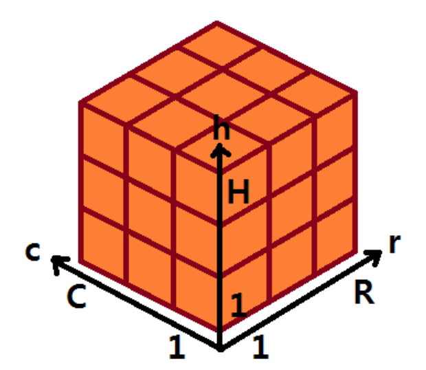
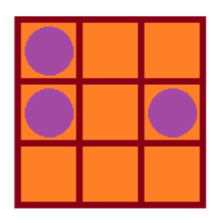

## 문제

맛있는 젤리가 있다! 이 젤리는 자르기 좋게 부피가 1인 정육면체 칸으로 구분되어 있으며 가로로는 R 칸, 세로로는 C 칸이며 높이는 H 칸으로 되어있다. 젤리에 건포도가 총 N 개 들어있는데, 건포도가 여러 칸에 걸쳐 있는 경우는 없으며, 한 칸에 두 개 이상의 건포도가 있는 경우는 없다. 그래서 젤리를 삼차원 배열처럼 보는 것으로 건포도의 위치를 세 개의 정수 (r,c,h)로 나타낼 수 있는데, 아래의 그림을 참고하라.

토깽이가 젤리를 정확히 N개의 조각으로 나누려고 하는데, 각 조각에는 건포도가 정확히 하나씩 들어 있어야 한다. 토깽이가 젤리를 자를 때는 정확히 칸이 맞게 잘라서 두 개의 직육면체로 나누어야 하며, 또한 중간에 자르는 것을 멈출 수는 없다. 토깽이는 나누어진 N개의 조각에서 가장 부피가 작은 조각의 부피를 최대한 크게 만들고 싶어한다. 토깽이를 도와 젤리를 카와이하게 잘라주자.

## 입력

첫 번째 줄에 젤리의 크기 R, C, H, N(1 ≤ R, C, H ≤ 7,1 ≤ N ≤ min(R × C × H, 77)) 이 공백으로 구분되어 주어진다.

다음 N개의 줄에는 각 건포도의 위치를 나타내는 세 개의 정수 r(1 ≤ r ≤ R),c(1 ≤ c ≤ C),h(1 ≤ h ≤ H)가 공백으로 구분되어 주어진다. 각 건포도의 위치는 중복되지 않는다.

## 출력

젤리를 각 조각에 건포도가 하나씩 존재하도록 정확히 N개로 나누었을 때 가장 작은 부피를 가진 조각의 부피를 최대화하면 얼마인지 출력한다.

## 힌트

젤리를 위에서 바라보면 위와 같고, 아무리 잘 잘라도 3 개 조각의 부피는 2, 3, 4 가 되어야 한다.
