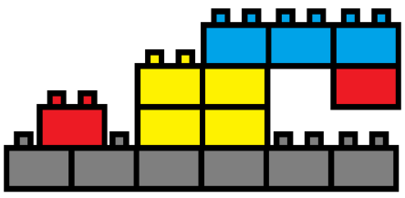

## 문제

영글이는 블록놀이를 하는 중이다. 영글이가 가진 블록에는 K 가지 종류가 있는데, 높이는 1 이며, 너비는 K 이하인 블록들이다. 크기가 같은 블록들은 모두 색깔이 같다. (크기가 다르다고 색이 무조건 다르지는 않다.) 또한 각 블록은 무한히 많이 있다. 예를 들어 K=3이고, 각 블록의 색이 다른 경우 다음과 같은 세 가지 블록이 무한히 많이 있는 것 이다.

이제 영글이는 자신이 가진 블록들을 너비가 W 인 블록 위에 블록을 쌓으려고 한다. 또한 너무 높이가 높으면 가지고 놀기에 좋지 않기 때문에 높이가 H 이하가 되게 쌓으려 고 한다. 다음은 W=6인 예이다.

블록을 쌓을 때는 칸이 정확히 맞게 쌓아야 하며, 또한 쌓고 난 블록의 밑에는 빈 공 간이 있어서는 안 된다. 왼쪽 그림은 가능한 경우 중 하나이며, 오른쪽 그림은 안 되는 경우의 예들 중 하나이다.

왼쪽 그림의 경우는 모든 블록이 조건을 만족하게 쌓여 있으며 높이는 4이다. 그러나 오른쪽 그림의 경우 가장 왼쪽의 빨간색 블록이 칸에 맞지 않게 쌓여 있다. 그리고 파란 색 블록의 중간 부분의 밑이 비어있으며, 또한 가장 오른쪽의 빨간색 블록의 밑부분도 비어 있으므로 이 경우는 제대로 쌓은 경우가 아니다.

영글이는 조건을 만족하면서 블록을 쌓을 수 있는 경우의 수를 구해보려고 한다. 하지만 그에게는 너무 귀찮은 일이었기 때문에, 당신에게 이 일을 부탁하고자 한다. 만약 정면에서 바라보았을 때, 블록의 색이 같은 경우는 같은 경우로 친다. 또한 아무것도 쌓이지 않은 경우도 하나의 경우로 친다.

## 입력

첫 번째 줄에는 영글이가 가진 블록의 수를 나타내는 정수 K (1 ≤ K ≤ 300), 그리고 영글이가 블록을 쌓기 시작하는 블록의 너비와, 최대로 쌓을 수 있는 블록의 높이를 나타내는 정수 W,H (1 ≤ W,H ≤ 300)가 공백으로 구분되어 주어진다.

두 번째 줄에는 K개의 정수가 주어지는데, i번째 입력된 수 Ci (1 ≤ Ci ≤ K)는 너비가 i인 블록의 색을 나타낸다.

## 출력

조건을 만족하게 블록을 쌓을 수 있는 경우의 수를 출력한다. 답이 매우 커질 수 있으므로 답을 1,000,000,007로 나눈 나머지를 출력한다.
