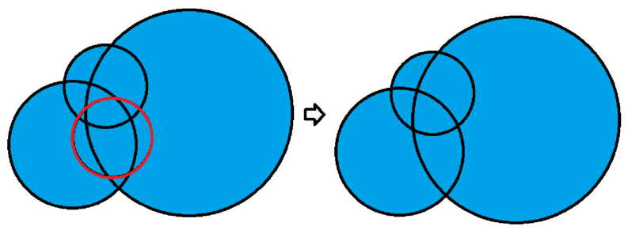

## 문제

아시다시피 mdic 은 유명한 pop artist 이다. 그가 만든 *masterpiece* 들을 모르는 사람이 있다고는 생각 할 수 없으므로 그의 작품들에 대한 설명은 생략하도록 하겠다. 요즘 그는 자신의 예술 철학의 완성을 위해 사람들과 떨어져 고독한 나날들을 보내고 있다. 그는 매일 다양한 예술적 시도를 하고 있는데 오늘은 오로지 **circle**(원)만을 이용해서 그림을 그리고 있다. 캔버스는 하얀색이고, 원들은 모두 파란색으로 속이 칠해져 있다. 우선 그는 모든 원들의 테두리를 검은색으로 하여 그림을 그린다. 그리고는 테두리를 파란색으로 칠하여 없앤다.

그러나 그는 어떤 원들은 없어져도 테두리를 없앤 결과가 같을 것이라는 사실을 알았다. 이런 원들을 노-답원이라고 하자.

예를 들어 위의 그림에서 빨간색으로 표시된 원을 없애도 테두리를 없앤 그림은 원래와 같다.

그가 그린 그림에서 노-답원은 여러 개가 나올 수 있다. 그는 그림을 그리기 전에 먼저 그림을 구상했다. 그리고 그가 해야 할 수고를 최대한 줄이기 위해 어떤 원들이 노-답원인지 알고 싶어한다. 그렇기에 똑똑한 프로그램인 당신에게 도움을 요청했다! mdic 을 도와주자!

## 입력

첫 번째 줄에 캔버스에 그릴 원의 개수 N (1 ≤ N ≤ 300)이 주어진다.

그리고 다음 N개의 줄에는 각 줄마다 각 원의 중심 좌표와 반지름을 나타내는 세 정수 x,y,r (|x|,|y| ≤ 1000,1 ≤ r ≤ 1,000)이 공백으로 구분되어 주어진다.

## 출력

노-답원의 개수를 출력한다.
