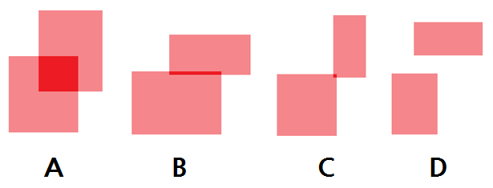

## 문제

축에 평행한 N-orthotope란 다음에 속하는 어떤 N 차원 점들의 집합이다.

[s1, e1] × [s2, e2] × ... × [sN, eN] (si < ei)  
(즉, N차원 점 (x1, x2, ..., xN)의 각 xi 가 si ≤ xi ≤ ei 인 점들의 집합이다.)

* N = 0인 경우는 특별히 0차원의 점이라고 정의하자.
* N = 1인 경우는 1차원에서 어느 선분을 의미한다.
* N = 2인 경우는 2차원에서 축에 평행한 어느 직사각형 형태의 영역이 된다.
* N = 3인 경우는 3차원에서 축에 평행한 어느 직육면체 형태의 영역이 된다.
* ...

조금 더 일반화하면,

[s1, e1] × [s2, e2] × ... × [sK, eK] (si ≤ ei)

를 만족하는 점들은 si < ei를 만족하는 i의 개수가 N개라면 축에 평행한 N-orthotope가 된다. 앞으로 '평행한'을 생략할 것이지만 앞으로 등장하는 orthotope도 평행한 orthotope라고 생각하면 된다.

어떤 N에 대해 두 개의 N-orthotope가 주어져 있다고 하자. 이때 두 영역에 동시에 속하는 점들이 있다면, 이 점들은 축에 M-orthotope가 된다. 이때 M이 무엇인지 구하는 프로그램을 작성하라. 예를 들어 2-orthotope의 경우 아래의 네 가지 경우가 있을 수 있다.

* A는 두 2-orthotope의 공통된 영역이 똑같이 2-orthotope가 되는 경우이다.
* B는 두 2-orthotope의 공통된 영역이 1-orthotope(선분)가 되는 경우이다.
* C는 두 2-orthotope의 공통된 영역이 0-orthotope(점)가 되는 경우이다.
* D는 두 2-orthotope의 공통된 영역이 없는 경우이다. 이 경우 -1을 출력하면 된다.

## 입력

첫 번째 줄에 자연수 N이 주어진다.

두 번째 줄에는 첫 번째 영역의 s1, e1, s2, e2, ⋯, sN, eN이 공백으로 구분되어 주어진다.

세 번째 줄에는 두 번째 영역의 s1, e1, s2, e2, ⋯, sN, eN이 공백으로 구분되어 주어진다.

이 수들은 모두 절댓값이 11 이하이며, 각 si, ei는 si < ei를 만족한다.

1 ≤ N ≤ 11인 입력이 주어진다.

## 출력

첫 번째 줄에 두 영역의 공통된 영역이 M-orthotope이면 M을 출력한다. 단 공통된 영역이 없는 경우 -1을 출력한다.
