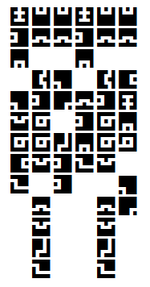

## 문제

고메즈는 고대 유적을 탐사하다 고대인들이 사용하던 문자가 써진 비석을 발견하게 되었다. 그러나 고메즈에게는 고대 문자에 대한 지식이 아무 것도 없어서 비석을 읽을 수 없었다. 그렇기에 고대 문자에 대한 지식이 해박하여 비석을 해석해줄 수 있는 사람을 찾고 있다. 당신이 고대 문자에 대한 지식이 해박하다면 불쌍한 고메즈를 도와주자!

## 입력

첫 번째 줄에는 두 개의 자연수 R, C(1 ≤ R, C ≤ 50)이 주어진다.

이후 6R - 1개의 줄에는 비석의 내용이 적혀 있다. 각 줄에는 6C - 1개의 문자가 적혀 있으며 문자는 '#' 또는 '.'이다. 예제를 보고 상세한 내용을 파악할 것을 권장한다.

## 출력

비석을 해석하여 출력한다. 출력하는 방식에 대한 모든 힌트는 주어져 있다.
