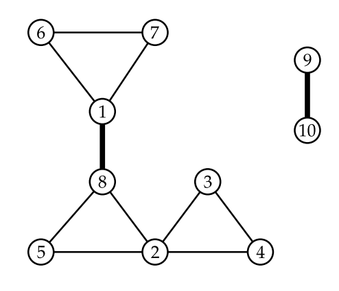

## 문제

In the land of the Cahoots, Lomikel is a god of pipes. He governs water pipes, drains, sewers, and maybe even subway tunnels. The Cahoots worship him at numerous sacred springs, which are connected by a huge network of ceremonial pipes. Each pipe directly connects two springs.

On every holiday, the Supreme Plumber (the highest of Lomikel’s priests) conducts complicated rituals which involve transport of water through the pipes.

Sometimes, Lomikel’s wrath causes a pipe to break, so the Plumber has to use other pipes to make the water flow around the broken pipe. This is not always possible – for some pipes, a different path does not exist. These pipes are called critical and the Plumber has to pay special attention to them. You can see critical pipes drawn in bold in the picture below.

Your task is to read a description of the network and find all critical pipes. However, the network is vast and you have only a limited amount of memory. Memory limit for this task is only 16 MB.

## 입력

The first line of the standard input contains two space-separated integers N and M. Here N is the number of springs (1 ≤ N ≤ 100 000) and M is the number of pipes (1 ≤ M ≤ 6 000 000).

Each of the following M lines describes a single pipe. It contains two space-separated integers u and v (1 ≤ u, v ≤ N) – the springs connected by the given pipe.

Two springs can be connected by multiple pipes, but endpoints of a single pipe are always different springs.

Technical note: It is possible to seek on the standard input (for example to rewind it back to the beginning), but seeking is not necessary to solve the task. Also, reading the input multiple times could be too slow.

## 출력

The standard output consists of a sequence of lines. Each line describes a single critical pipe and it contains two space-separated integers: the endpoints of the pipe.

Critical pipes can be listed in an arbitrary order and so do the endpoints of any single pipe.

## 힌트

