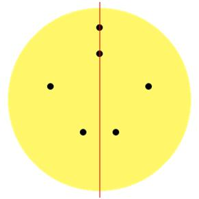
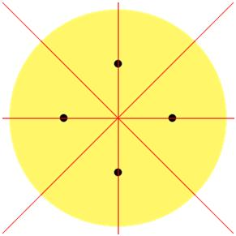

## 문제

민식이는 동그란 피자(원)를 한 번 잘라서 두 개의 크기가 같은 조각으로 자르려고 한다. 피자는 여러 개의 토핑을 포함하고 있고, 이것은 원 위의 한 점으로 표현한다.

컷이 아름답다고 하는 것은 잘랐을 때, 두 피자가 거울에 비춘것 처럼 대칭일 때이다.

아래 그림은 피자의 한 예이다. 검정 점은 토핑이고, 아래 조각의 아름다운 컷의 개수는 1개이다.

아래 피자는 아름다운 컷이 총 4개 있다.

피자가 주어지고, 토핑의 위치가 주어졌을 때, 아름다운 컷의 개수를 출력하는 프로그램을 작성하시오. 피자의 크기는 무한히 크기 때문에, 모든 토핑을 포함할 수 있다. 그리고, 피자의 중심이 좌표가 (0, 0)이다.

## 입력

첫째 줄에 토핑의 개수 N이 주어진다. N은 50보다 작거나 같은 자연수이다. 둘째 줄부터 N개의 줄에 토핑의 위치가 주어진다. 좌표는 절댓값이 500보다 작거나 같은 정수이다. 그리고 토핑의 위치는 중복되지 않는다.

## 출력

첫째 줄에 문제의 정답을 출력한다. 만약 아름다운 컷의 개수가 무한대일 경우에는 -1을 출력한다.
