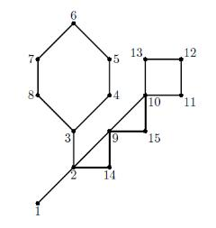

## 문제

Cactus란 그래프 상의 모든 에지가 최대 하나의 사이클에만 속한 연결된 양방향 그래프이다. 즉, Cactus는 몇몇 그래프를 포함하는 트리라고 생각하면 된다.

문제는 주어진 Cactus의 지름을 찾는 것이다. 지름이란 모든 두 점 사이의 최단 거리 중 최대 거리를 뜻한다.

위의 Cactus의 예에서는 6번 정점에서 12번 정점까지의 최단경로가 8로 이 두 점 사이의 최단 경로가 Cactus 내에 존재하는 최단경로 중 최대가 되므로 지름은 8이 된다.

## 입력

첫 줄에는 정점의 개수 N(1 ≤ N ≤ 50,000)과 간선의 집합 개수 M(0 ≤ M ≤ 10,000)이 주어진다. 다음 M개의 줄에 M개의 간선의 집합에 대한 정보가 주어지는데, 각 줄에 첫 번째 수 Ki(1 ≤ Ki ≤ 1,000)는 i번째 에지 집합의 개수를 나타낸다. 다음 Ki개의 수는 정점의 번호를 나타내는데 인접한 두 정점간의 에지가 집합에 포함되는 것을 의미한다.

## 출력

첫 줄에 Cactus의 지름을 출력한다.
