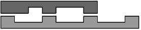
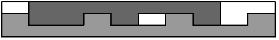

## 문제

세계적으로 유명한 엄지민 자동차 회사는 효율적인 킥다운 장치를 만들어달라는 의뢰를 받았다. 킥다운이란 자동차에서 낮은 기어로 바꾸는 장치를 의미한다. 연구 끝에 효율적인 킥다운 장치는 '이'와 '홈'이 불규칙하게 배열되어 있는 기어로 만들어져야 한다는 것을 알았다.

첫 번째 그림과 같이 두 기어 파트가 서로 마주보고 있게 된다. 튀어나온 것이 기어의 이, 들어간 곳이 홈이다. 그리고 이들을 두 번째 그림과 같이 서로 맞물리게 끼우는 것으로 킥다운 장치를 만들 수 있다. 하지만 문제는 맞물리게 하였을 때 가로 너비가 짧을수록 효율적인 킥다운 장치가 된다. 때문에 문제는 두 기어가 주어졌을 때 맞물리게 하는 가장 짧은 가로 너비를 구하는 것이다.

## 입력

첫 줄에는 첫 번째 기어 파트를 나타내는 1과 2로 구성된 문자열이 주어진다. 두 번째 줄에는 마찬가지로 두 번째 기어 파트를 나타내는 1, 2로 구성된 문자열이 주어진다. 여기서 1은 홈을, 2는 이를 의미한다. 길이 <= 100

## 출력

첫 줄에 만들 수 있는 가장 짧은 가로 너비를 출력한다.
