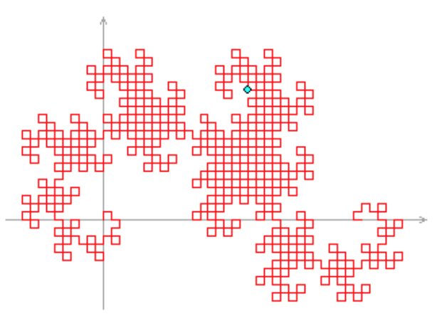

## 문제

Cho D0 là chuỗi hai kí tự "Fa". Với n ≥ 1, tạo ra Dn từ Dn-1 theo các quy tắc viết lại chuỗi:

* "a" → "aRbFR"
* "b" → "LFaLb"

Do đó, D0 = "Fa", D1 = "FaRbFR", D2 = "FaRbFRRLFaLbFR", ...

Các chuỗi có thể được hiểu như chỉ dẫn của một chương trình đồ họa máy tính: "F" có nghĩa là "vẽ về phía trước đoạn một đơn vị"; "L" có nghĩa là "rẽ trái 90 độ"; "R" có nghĩa là "rẽ phải 90 độ"; "a" và "b" bị bỏ qua.

Con trỏ máy tính ban đầu ở vị trí (0,0), hướng về phía (0,1).

Khi đó bản vẽ kỳ lạ Dn được gọi là Đường Rồng bậc n. Ví dụ, D10 được hiển thị ở hình bên. coi "F" là một bước, vị trí xanh tại (18,16) là vị trí đạt được sau 500 bước.

Vị trí của con trỏ X bước trong DN là ở đâu?

Đưa ra câu trả lời của bạn ở dạng x, y không có khoảng trống ở giữa.

## 입력

Gồm nhiều bộ test, mỗi bộ test ghi trên một dòng gồm 2 số nguyên X ≤ 1013 và N ≤ 100

## 출력

Với mỗi test, in ra trên một dòng vị trí x và y cách nhau 1 dấu cách
