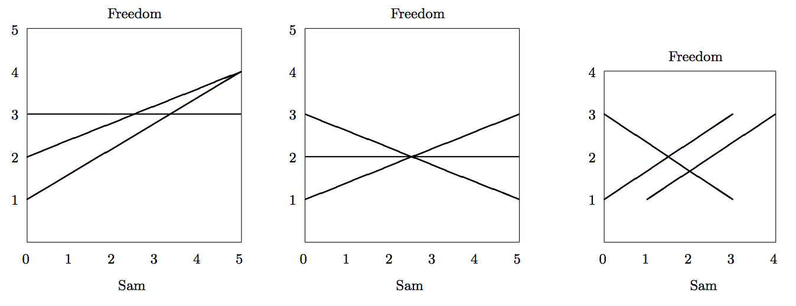

## 문제

Sam Gamgee and Frodo Baggins are trapped in Shelob’s lair. Shelob is a gigantic spider who lives in the caves at the edge of Mordor. Sam and Frodo are Hobbits, which means that they are little people with hairy feet.

The cave is a large rectangular cavern and Shelob has cast many great webs in the cave, and now Frodo and Sam (who are at the South wall of the cave) must reach the North wall to escape. If Sam and Frodo touch any of the web, they will become stuck and Shelob will come and eat them.

Sam has a magic sword, Sting, that can cut through Shelob’s web. However, Frodo is poisoned and Sam is exhausted from their adventures, so Sam only has the strength to make one vertical slice through the web once. A well-chosen slice at a point will cut through all of the webs that pass through the point, allowing Sam and Frodo to pass. Sam and Frodo, being little people, can fit through an infinitely small slit.

Given the locations of all the webs in the cave, determine if it is possible for Sam and Frodo to escape.

We suppose that each web is a vertical sheet that runs from one point (given by Cartesian coordinates) to another point. The webs are fixed at the roof and the floor of the cave, and run in a straight line between the two points. Multiple webs can cross one another (Shelob is a skilled web spinner) and if Sam were to slice exactly where they cross he could slice all of the webs at once. No web touches the North or South wall of the cave. Sam is also able to cut at precisely the point one or more webs connect to the East or West walls of the cave. You may treat Frodo and Sam as a point, so they can fit through the vertical cut and can fit between two webs that do not intersect.

## 입력

The input contains a single test case.

The first line consists of three integers, w (the width of the cave), d (the depth of the cave), and n (the number of webs that are cast), where 1 ≤ w, d ≤ 1000 and 1 ≤ n ≤ 500.

Next, n lines follow where each line contains 4 integers, x1, y1, x2, y2, where 0 ≤ x1, x2 ≤ w and 0 < y1, y2 < d. (x1, y1) is the Cartesian coordinates of one end of the web, and (x2, y2) is the Cartesian coordinate at the other end of the web. The coordinates are arranged so that the South-West corner of the cave is the point (0, 0), and the North-East corner is the point (w, d).

## 출력

If it is possible for Frodo and Sam to reach the North wall, making at most one slice through the web, print the line:

```

We can make it Mr Frodo!
```

If it is impossible for Frodo and Sam to reach the North wall without making more than one slice through the web, print the line:

```

We're doomed Mr Frodo!
```

## 힌트

The following diagrams are images for the Sample Inputs:


