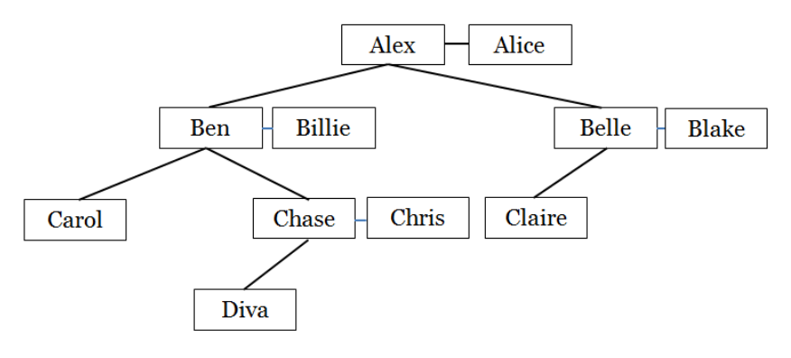

## 문제

Aunt Clara-May has been taking an interest in the genealogy of the family. She is able to construct a family tree but is getting confused with the relationships between different members of the family.

She wants to identify the following relationships: father, mother, uncle, aunt, son, daughter, nephew, niece, cousin, husband and wife. She also wants to be able to recognise whether the members in the family are related by blood or by marriage (i.e. in-laws), as well as different generations in the family such as grandparents, grandchildren, great grandparents, great grandchildren, great great grandparents, great great grandchildren etc. and different degrees of cousins including levels of removedness (e.g. second cousins-in-law twice removed).

Aunty C-M, as you call her, has some definitions of these relationships but needs your help to write a program to construct the family tree and name the relationships.

You have told Aunty C-M that you will help under the following conditions:

* no second marriages which require step relationships e.g. step-brother and step-father will be recorded
* all children in the family tree will be the offspring of a male father and a female mother who are married
* no marriages between siblings or between cousins of any type have occurred
* all people in the family tree are connected

Further to those conditions, the following definitions apply:

* `father` and `mother` are the parents of a child
* `brother` and `sister` are male and female siblings with the same parents
* `son` and `daughter` are the children of a parent
* `uncle` and `aunt` are the brother and sister of a child’s parent
* `nephew` and `niece` are the male and female children of a sibling
* a `grandfather` and `grandmother` are the male and female parents, respectively of a child’s parent
* a `great grandfather` and `great grandmother` are the father and mother, respectively, of a child’s grandparent
* a `great uncle` or `great aunt` is a sibling to a child’s grandparent
* `cousins` (not removed) are at the same level in the family tree
  + first cousins have the same grandparents
  + second cousins have the same great grandparents
  + and so on
* removed cousins are at different levels in the family tree
  + a `first cousin once removed` is the child of one of the first cousins
  + a `first cousin twice removed` is the grandchild of one of the first cousins
  + and so on
* cousin relationships are symmetric e.g. if A is the first cousin twice removed of B, B is also the first cousin twice removed of A
* where a relationship occurs due to marriage of two people the relationship is said to be in-law
  + the parent of a person’s husband or wife is a `father-in-law` or `mother-in-law`
  + the sibling of a person’s husband or wife is a `brother-in-law` or `sister-in-law`
  + the cousin of a person’s husband or wife is a `cousin-in-law`

`​​`Figure 1 displays the family tree described in the Sample Input. Your program should be able to say that `Claire and Carol are 1st cousins`, `Claire and Diva are 1st cousins 1-time removed`, and `Claire and Chris are cousins-in-law`. Your program should also be able to generate any other relationship combinations when queried.



Figure 1: Sample Input

## 입력

The input contains a single test case.

The input consists of a list of relationships for construction of the family tree. The list of relationships will be followed by a list of queries for which you will name the relationship. Relationships will be provided to infer the gender of all family members.

All relationships will be in lower case and all names will be unique. At most one person in each marriage will have parents present in the input.

The first line of input contains a single integer r (1 ≤ r ≤ 200) being the number of relationships for building the family tree. r lines of relationship definitions follow. Each relationship consists of three alphabetic strings, name1, name2 and relation, each separated by a single space. relation will be one of `husband`, `wife`, `son` or `daughter`. The relationship line can be read as:

```

name1 is the relation of name2
```

The relationships are followed by a line containing a single integer q (1 ≤ q ≤ 200) being the number of queries on the family tree. q query lines follow. Each query line consists of two strings, name1 and name2 separated by a single space. The names in the queries will be contained in the family tree.

## 출력

For each relationship query, output the relationship between name1 and name2 on a single line.

In the following definitions mandatory items are delimited with `(` and `)`, optional items are delimited with `[` and `]`, options are separated by `|`. Elements which may require repetition (1 to many) are followed by `*`.

* For a spousal relationship i.e. `husband` or `wife`, output a sentence of the following form:

```

name1 is the (husband|wife) of name2
```

* For a sibling relationship i.e. `brother` or `sister`, output a sentence of the following form:

```

name1 is the (brother|sister)[-in-law] of name2
```

* If the relationship is some kind of cousin, output a sentence which includes the degree of cousinship i.e. `1st`, `2nd`, `3rd` etc. followed by the word `cousins`, then the suffix `-in-law` if and only if the relationship is by marriage and finally the number of times removed (`1-time removed`, `2-times removed`, `3-times removed`, etc.).

```

name1 and name2 are (1st|2nd|3rd|...) cousins[-in-law][ (1-time|2-times|3-times|...) removed]
```

* If the relationship is aunt, uncle, nephew or niece, the output may require one or more instances of the word `great`.

```

name1 is the [great ]*(aunt|uncle|nephew|niece)[-in-law] of name2
```

* Otherwise the relationship will be one of `son`, `daughter`, `father` or `mother`. Relationships which are two generations apart will require the use of the word `grand` before the relationship. Relationships which are more than two generations apart will require the use of one or more instances of the word `great` before the word `grand`.

```

name1 is the [[great ]*grand](son|daughter|father|mother)[-in-law] of name2
```
