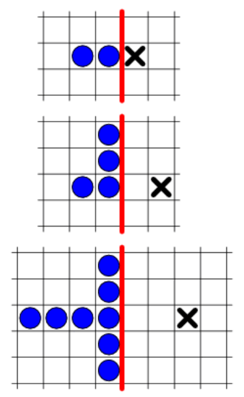

## 문제

A group of frogs is sitting on an infinite xy grid. The frogs all have non-positive x coordinates. On the grid location (2, 0) there’s a fly. The frogs are hungry and would like to get there to eat the fly. There’s one catch; a frog can only move by jumping over another frog sitting next to it, and then the frog being jumped over explodes. So the frog John sitting at (−1, 0) can jump to (1, 0) if Peter sits at (0, 0), but then Peter explodes and is gone. Similarly, if Alfred sits at (−1, 2) and Barney sits at (−1, 1), then Alfred can jump to (−1, 0) and Barney explodes.

So getting to the fly is going to have a high cost in frog lives, but the frogs all believe in the common good and are willing to sacrifice everything for the sake. The question however is whether they can make it at all. Given the location of the fly on the non-negative x axis, how many frogs do you need to start with? The frogs can initially be placed anywhere on or to the left of the y-axis, but must have distinct locations.

## 입력

The first line of the input gives the number of test cases T ≤ 100. For each test case, there’s one line with a single integer 0 ≤ X ≤ 31, meaning that the fly is located at (X, 0).

## 출력

For each test case, output one line with the number of frogs you need to start with to catch the fly, or “frogger” if it’s not possible to do it.
