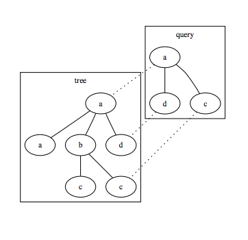

## 문제

Today Erik Axel’s wife chose a green tie, so he knows all unit tests will pass. This is most fortunate, as his boss has a tough assignment for him. There was an article in PHBweekly describing a study about organizational structures, performed by a group of Swedish psychologists. They had identified a set of patterns which they deemed dangerous to have in any organization tree, for example an engineer having an economist somewhere above him.

The boss has copied all the patterns from the article, and Erik Axel must now write a program to search for these in his consulting firm’s organization tree. For each pattern, he must see if there is an injective mapping f from the rooted query pattern tree P to the rooted target tree T, maintaining labels and ancestorship both ways (liberal translation of his boss’ words). This means f(u) = f(v) if and only if u = v, label(u) = label(f(u)), and u is an ancestor of v if and only if f(u) is an ancestor of f(v).

## 입력

The first line of input defines the target tree, which has 1 ≤ n ≤ 10000 nodes. A node is described by its label, which is a string of length 1 ≤ p ≤ 10 of lower case letters, and then possibly its list of children. A list of children is enclosed in parentheses, and separated by commas. Then follows a line with 1 ≤ q ≤ 100, the number of queries. Then follow q lines, each defining a query tree, with 1 ≤ m ≤ 16 nodes.

## 출력

For each test case, output a line with “disaster” if there is a match for the query, or “great success” otherwise.
