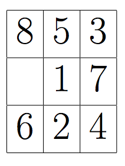
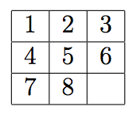

## 문제

You just got your sweet little brother Erling an entertaining puzzle. It is a 3 x 3 board with eight quadratic pieces, where you can slide a piece into the open slot. After rearranging the pieces randomly, the goal of the game is to get the board into the configuration

by sliding pieces one by one.

After playing with a puzzle for a while, Erling claims that he can solve any instance in a minimal number of steps. Since you don’t believe him, you write a program to solve the puzzles optimally.

## 입력

The first line of input gives 1 ≤ n ≤ 100, the number of test cases, followed by a blank line. Each test case is given by three lines giving the start configuration of the board, each consisting of three symbols, followed by a blank line. The cases all contain the symbols 1 . . . 8 and # exactly once, where the latter represents an open space.

## 출력

For each test case output the minimum number of moves to solve the puzzle, or impossible if it cannot be done.
