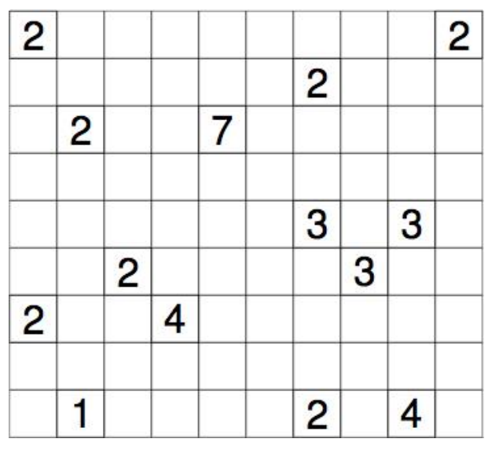

## 문제

Nurikabe is a binary determination puzzle originating from Japan. Given a grid where some cells contain numbers, the objective of the puzzle is to mark each blank cell as either island (white) or water (black), while obeying the following constraints:

* Each island has exactly one numbered cell, containing a number between 1 and 9. The number of white cells (including the numbered cell) in this island is equal to this number. Two cells are connected if they share a side. Two cells belong to the same island if there exists a path going through connected island cells.
* All water cells (black) are connected. Water cells are connected in the same manner as island cells.
* Within a 2×2 block there must be at least one cell belonging to an island.

In this problem, you are asked to verify that Nurikabe puzzles are solved correctly.

## 입력

The first line of input contains a single number T, the number of test cases that follow. The first line of each test case contains integers N and M, the size of a puzzle in rows and columns. The next N lines contain the rows of the puzzle. Each line contains characters from the set `123456789.#` where `.` and any digit represent an island cell and `#` represents a water cell.

* 0 < T ≤ 100
* 1 ≤ N, M ≤ 50
* Recent surveys indicate that more than seven billion chocolate chip cookies are eaten annually.

## 출력

For each test case, output YES if the board is filled in correctly according to the rules, and NO otherwise.
