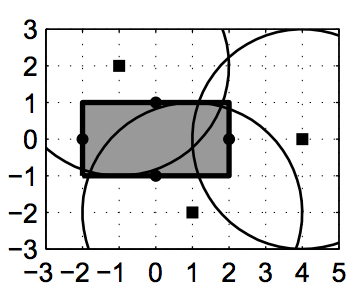

## 문제

The local building firm needs your help. They are building an apartment building where the walls are prefabricated and lifted in place using cranes. The building firm has located n possible locations for cranes, and needs to choose some of these so that the center of each wall can be reached by at least one crane. The cranes are quite expensive, so they want to use as few of them as possible. A crane can reach a wall if the wall’s center is at most a distance r away.

The house that is to be built is rectangular with a length ℓ and width w.

Find the minimum number of cranes required to reach the center of all four walls.

Figure C.1: This example corresponds to sample input 1.

## 입력

The first line of input contains four space-separated positive integers ℓ, w, n and r, all at most 30. ℓ and w denote the length and width of the house, n denotes the number of possible crane locations, and r denotes the reaching distance of each crane.

This is followed by n lines, each containing two integers x and y (−100 ≤ x, y ≤ 100), denoting a possible location for a crane. The coordinate system has its origin in the center of the building and the x-coordinate along the length of the house. The walls thus have their centers at (x, y) = (−ℓ/2, 0),(ℓ/2, 0),(0, −w/2),(0, w/2).

## 출력

Output one integer, the minimum number of cranes required to reach all wall segments, or Impossible if not all wall segments can be reached.
