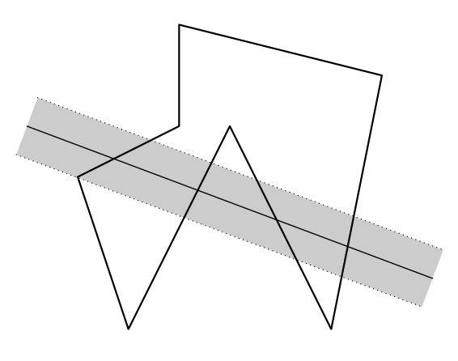

## 문제

The Slovak Government is building a highway from Bratislava to Košice. The highway will pass through a forest where a lot of animals live. Frog Gizela, the queen of the animals, wants to calculate the impact of the highway on their lives. Since the highway will be noisy, animals don’t want to live within distance d from the highway. Gizela wants to know how large the inhabitable area will be. If the total inhabitable area of the forest is too small, Gizela will have to find a new forest for her kingdom.

You are given a description of the forest and the highway. The forest is a simple polygon, i.e. its sides do not cross, and the highway can be considered a straight line of width zero. You are also given d, the safe distance from the highway. Calculate the size of the inhabitable area of the forest.

Figure G.1: Drawing of the sample input

## 입력

The first line of the input contains one integer N (3 ≤ N ≤ 250 000) denoting the number of vertices of the polygon. N lines follow with two floating point numbers xi and yi, denoting that the i-th point of the polygon is (xi, yi).

Next line contains 4 floating point numbers xa, ya, xb, yb, denoting that the highway passes through points (xa, ya) and (xb, yb). The last line of the input contains one positive floating point number d, the safe distance from the highway.

All floating point numbers will be at most 100 000 in absolute value and will have at most 4 digits after the decimal point.

## 출력

Output one line with one number – the size of the inhabitable area of the forest. Results with relative or absolute error 10−7 will be considered correct.
