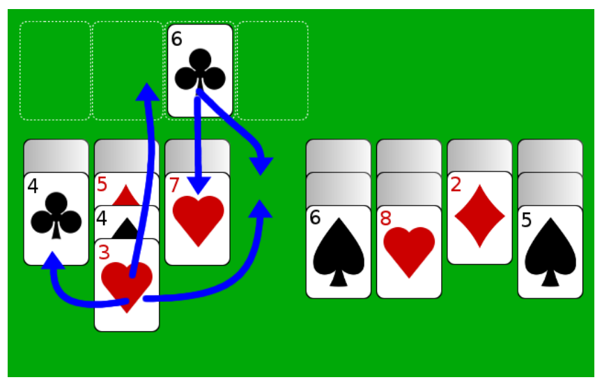

## 문제

FreeCell Solitaire is, just as computer science, mostly about sorting. The goal is to sort a deck of cards using a fairly convoluted algorithm.

The rules are the following: A shuffled deck is laid out in eight stacks. Only the topmost card of a stack may be moved. A card of value v may be moved to the top of another stack only if the column is empty, or if the topmost card of the destination stack is of the opposite color and of value v + 1. For instance the three of hearts may be moved on top of the four of clubs. At your disposal you have four free cells (think of them as the available memory if you like!) that are initially empty. Free cells can hold at most one card each, which can be moved according to the same rules as stack cards. Figure H.1 below illustrates a few legal moves.

Figure H.1: Legal moves for the three of hearts and six of clubs

Most FreeCell computer games allow you to move a pile of cards, provided there are enough empty cells and empty stacks to accomplish this by moving cards from the pile one by one. In the image above for instance, the whole pile with 5, 4 and 3 can be moved over 6 of spades by using some of the free cells and the empty stack to temporarily hold 3 and 4.

You would like to move a sorted pile of K cards from one stack to the top of another stack which is non-empty, but of appropriate color and value. You will ignore all other non-empty stacks, because otherwise you would have to take into account the color and value of the topmost card of those stacks and that would be too complicated.

Even though you ignore the other non-empty stacks, you can still use N free cells and M empty stacks. Is it possible to perform this move?

## 입력

The input consists of several test cases. Each test case is represented by a line with three numbers N, M and K respectively. N is the number of free cells, M is the number of empty stacks and K is the size of the pile you are moving. We are considering a generalized form of Free Cell in which 0 ≤ N, M ≤ 5 and 0 ≤ K ≤ 100.

## 출력

The program should print “yes” if it is possible to move a pile of K cards using N free cells and M empty stacks, and “no” otherwise.
