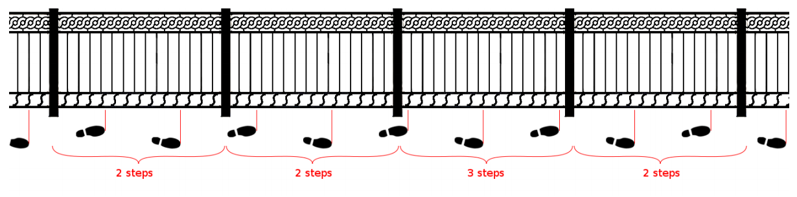

## 문제

The old Count von Walken ponders along the fence of his backyard. The fence has a repeating pattern with poles in the ground at equal distances. Since von Walken has nothing better to do, he counts the number of steps he takes between each pole.

The distance between two consecutive poles turns out not to be an integer multiple of the length of his steps because sometimes he takes two steps between the poles, and sometimes he takes three steps.

Figure I.1: A picture of sample case 2

Von Walken knows that his steps are always 1 meter long, so he starts thinking of what the distance between the poles may be. “It must be more than 2 meters, since I occasionally can fit 3 steps between the poles, but it must be less than 3 meters, since I sometimes only fit 2 steps in between.”

Given a list of step counts and a distance D, determine whether it is possible that the distance between two poles is D meters. The poles can be considered to have width 0, and each step is strictly between two poles.

To avoid problems with floating point numbers, the result is guaranteed to be the same even if any pole is moved up to 10−7 meters.

## 입력

The input consists of a line containing the real number D and an integer N, followed by a line with the space-separated list of integer step counts, c1, c2, . . . , cN . It holds that 2 ≤ ci, D ≤ 3 and that 0 ≤ N ≤ 10 000.

## 출력

The program should print “possible” if D meters is a possible distance between the poles, and “impossible” otherwise.
