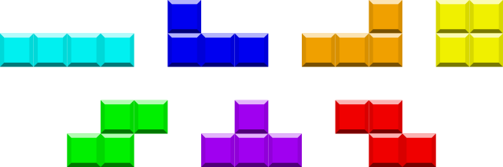

## 문제

It is 1990 and you are in the development team of a video game that is going to revolutionize the future of arcades. The player is given a rectangular board with some white and black squares. The goal is to turn the whole board white. At each turn, the player may choose a tetromino from an infinite supply, move and rotate it within the limits of the board, and toggle the colour of the four squares covered by the tetromino. A tetromino is a connected set of 4 squares (see Figure D.1).

Unfortunately, the testing team has been complaining about some levels being impossible to solve. You know that testers are skilled enough to place a piece in any position and rotation needed, so the problem may be somewhere else. Your next debugging step is to write a program that checks whether a level is solvable.

Figure D.1: All tetrominoes. [From Wikimedia](./002_File_Tetrominoes_IJLO_STZ_Worlds.svg).

## 입력

The first line contains two integers m and n (1 ≤ m, n ≤ 100), the dimensions of the board. m lines with n characters each follow. The character ‘.’ represents a white square, and the character ‘X’ represents a black square.

## 출력

One line with the word “possible” if the level is solvable and “impossible” if it is not.
