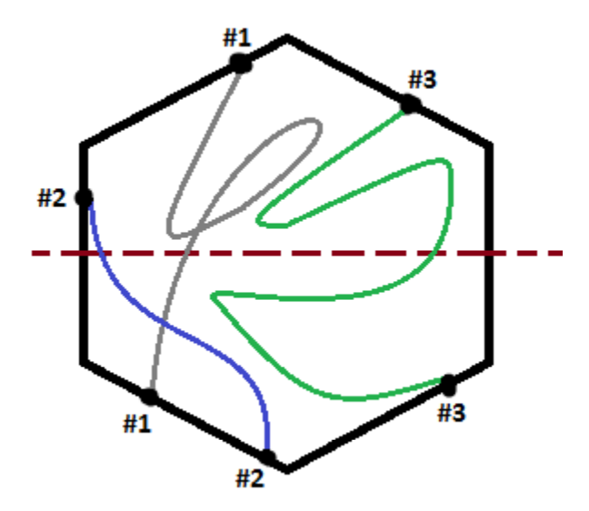

## 문제

The Shibuya scramble crossing in Tokyo is infamous for being heavily used, resulting in people bumping into each other. The crossing can be modeled as a convex polygon, where the n people about to cross initially stand at a point that is on the perimeter of the polygon and in its lower half. When the traffic lights change, each person starts to walk towards a unique point on the perimeter in the upper half of the polygon. The path each person takes may look like spaghetti (it may even cross itself), but it will never leave the polygon and no two paths will cross more than once.

Oskar who is a badass geek observes the crossing from the Starbucks nearby. He has numbered the people in the crossing consecutively 1 through n in counter-clockwise order (starting with the person at the very left). Sadly he doesn’t know the intended paths of the people at the crossing, but he has gathered some intelligence telling him exactly which persons’ paths will cross one another (and this information is consistent with the physical reality).

Being a nerd he obviously knows about Murphy’s Law saying “Anything that can go wrong, will go wrong!”. So all people who could possibly bump into each other, i.e., all people whose paths cross, will actually bump into each other! He now asks himself, “After all the n people have crossed, what is the size of the largest group of people where everyone has bumped into each other?”. Now that is a geeky and tough question, can you help him?

Figure E.1: A beautiful illustration of a possible interpretation of the first sample test case.

## 입력

The first line contains an integer 1 ≤ n ≤ 800, the number of people at the crossing, and an integer 0 ≤ m ≤ 10 000, the number of paths that will cross, i.e., intersect one another. The next m lines each contain two integers a and b, 1 ≤ a < b ≤ n, meaning that the path taken by person a will cross the path taken by person b. (No pair will occur twice in the input.)

## 출력

Output a single integer giving the size of the largest group of people where everyone has bumped into one another.
