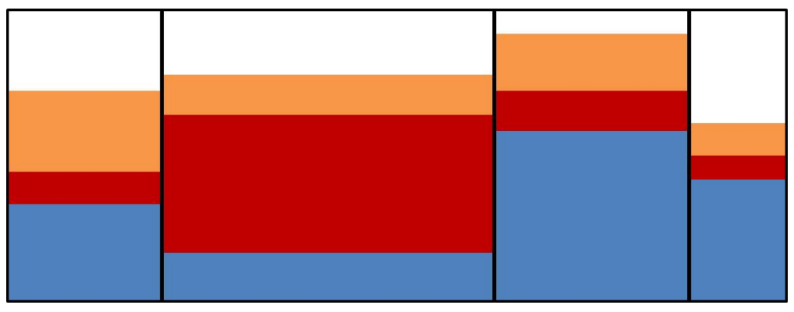

## 문제

At art shows, it is very common to have booths where children can create their very own sand art. This art is typically made by taking a jar or bottle and filling it with layers of different colors of sand. Instead of a bottle, this year a new container is being used for decorating! The container is a glass box!

The box has a 2D rectangular face and a thickness of exactly 1 unit. Inside the glass box, n − 1 vertical dividers are placed to separate it into n sections. In the example below, the box is divided into 4 sections using 3 dividers:

Sometimes the children want certain amounts of each color to be in each section of their work of art. They specify a minimum and maximum for each combination of section and sand color. Your task is to help them find how balanced they can make the artwork. This is done by minimizing the difference between the sand heights in the section with the highest overall sand level and the section with the lowest overall sand level.

## 입력

Each input will consist of a single test case. Note that your program may be run multiple times on different inputs. Each input begins with a single line with 4 space-separated integers, n m w h, where:

* n (2 ≤ n ≤ 200) is the number of sections
* m (1 ≤ m ≤ 200) is the number of colors of sand
* w, h (1 ≤ w, h ≤ 5 000) are the width and height of the box (it always has a depth of 1)

The next line will contain m space-separated real numbers (with at most 3 decimal places) v (0 < v ≤ w·h), which represent the volumes of each color of sand. It is not necessary to use all of the sand, but the minimums for each section must be satisfied.

The next line will have n − 1 space-separated real numbers with at most 3 decimal places) x (0 < x < w) which represent the distance from the left wall of each divider. The xs are guaranteed to be sorted in increasing order.

The next n lines will each have m space-separated real numbers (with at most 3 decimal places) min (0 ≤ min ≤ w · h). The jth element of the ith row is the minimum amount of sand color j to be put in section i.

The next n lines will each have m space-separated real numbers (with at most 3 decimal places) max (0 ≤ max ≤ w · h). The jth element of the ith row is the maximum amount of sand color j to be put in section i, and minij ≤ maxij.

## 출력

Output a real number rounded to exactly 3 decimal places representing the minimum difference possible between the maximum and minimum heights of sand in the sections. A distribution of sand will always be possible that satisfies the constraints in the input.
