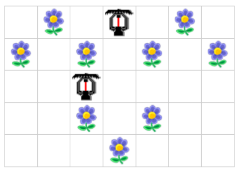

## 문제

ีสวนดอกไม้สวนหนึ่งเป็นตารางสี่เหลี่ยมขนาด 106 แถว x 106 คอลัมน์ มีดอกไม้อยู่ในสวนทั้งหมด N ดอก โดยดอกไม้ดอกที่ i อยู่ที่แถว ri คอลัมน์ ci คุณได้รับมอบหมายให้จัดวางเครื่องฉีดน้ า โดยสามารถจัดวางลงบนแปลงว่าง(แปลงที่ไม่มีดอกไม้) แปลงไหนก็ได้โดยเครื่องฉีดน้ ารุ่นนี้สามารถฉีดน้ าออกเป็นสี่สายในทิศ บนขวา ล่าง และซ้าย ในแนวขนานกับตาราง

นอกจากนี้ ดอกไม้ในสวนมีลักษณะพิเศษคือ เมื่อได้รับน้ าจากทิศใดทิศหนึ่งจะสามารถกระจายน้ าไปในทิศทางที่เหลือได้ด้วย (บน ขวา ล่าง และซ้าย) โดยล าน้ าในแนวตั้งและแนวนอนอยู่คนละระดับสามารถข้ามกันได้อยากทราบว่าต้องใช้เครื่องฉีดน้ าจ านวนน้อยที่สุดกี่เครื่องเพื่อรดน้ าดอกไม้ให้ครบทุกดอก

## 입력

บรรทัดแรกเป็นจ านวนกรณีทดสอบ T ชุด (1 ≤ T ≤ 20) กรณีทดสอบแต่ละชุดประกอบด้วยข้อมูลดังนี้

1. บรรทัดแรก ระบุจ านวนดอกไม้ในสวน N ดอก (1 ≤ N ≤ 100 000)
2. ถัดมา N บรรทัด ระบุแถวและคอลัมน์ของดอกไม้แต่ละดอก ri และ ci ตามล าดับ รับประกันว่าไม่มีดอกไม้มากกว่าหนึ่งดอกอยู่บนแปลงเดียวกัน (1 ≤ ri, ci ≤ 1 000 000)

## 출력

ส าหรับกรณีทดสอบแต่ละชุด ให้พิมพ์จ านวนเครื่องฉีดน้ าที่น้อยที่สุดที่สามารถรดน้ าดอกไม้ครบทุกดอกได้

## 힌트

ตัวอย่างการวางเครื่องฉีดน้ าที่ใช้จ านวนเครื่องน้อยที่สุด

กรณีทดสอบที่หนึ่ง

กรณีทดสอบที่สอง
