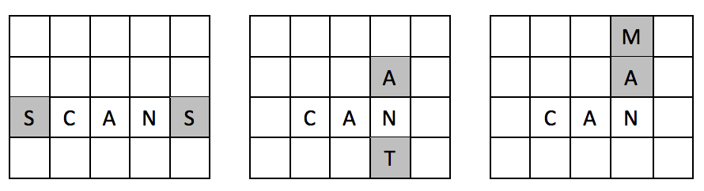
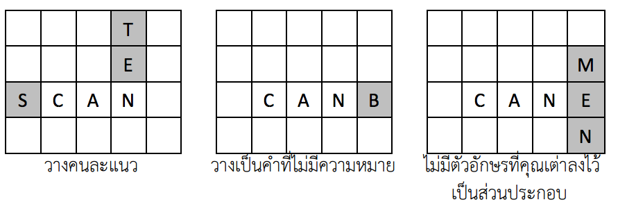

## 문제

กาลครั้งหนึ่งนานมาแล้ว มีหมู่บ้านแห่งหนึ่งอันไกลโพ้น สรรพสัตว์อาศัยอยู่ร่วมกันอย่างมีความสุข ทุก ปีจะมีการจัดงานประจ าปี รวมทั้งมีการแข่งขันกีฬาต่างๆ หนึ่งในกีฬาที่มีการแข่งขัน คือ Crossword โดยการ แข่งขันในครั้งนี้เป็นการแข่งขันระหว่างทีมกระต่ายและทีมเต่า โดยมีกติกาและวิธีการแข่งขันดังนี้

1. อุปกรณ์การเล่น ประกอบด้วย กระดานมาตรฐานขนาด 15 x 15 ช่อง และเบี้ยอักษรภาษาอังกฤษ A ถึง Z ไม่จ ากัดจ านวน โดยแต่ละทีมจะมีเบี้ยในแป้นฝ่ายละ 7 ตัว
2. การแข่งขันแต่ละรอบถูกแบ่งเป็น 2 ตา โดยทีมกระต่ายได้เล่นในตาที่ 2 เสมอ
3. ในตาที่ 1 คุณเต่าต้องวางเบี้ยลงในกระดานให้เรียงติดต่อกันในแนวนอนหรือแนวตั้ง ให้เป็นค าที่มี ความหมาย โดยต้องมีเบี้ยตัวหนึ่งวางลงในช่องดาว
4. ในตาที่ 2 กระต่ายน้อยต้องวางเบี้ยลงในกระดานต่อจากเบี้ยของคุณเต่า โดยเบี้ยที่ลงต้องอยู่ในแนว เดียวกันเท่านั้น และเมื่ออ่านตัวอักษรที่เรียงติดกันทั้งแนวนอนและแนวตั้ง จะต้องเป็นค าที่มี ความหมาย ซึ่งค าใหม่ที่เกิดขึ้นนั้นจะต้องมีตัวอักษรที่คุณเต่าได้ลงไว้เป็นส่วนประกอบด้วยอย่างน้อย 1 ตัวอักษร ตัวอย่างเช่น ถ้ามีค าว่า “CAN” อยู่บนกระดานแล้วจะสามารถวางเพิ่มเป็นแบบใดแบบหนึ่งในนี้ได้

แต่ไม่สามารถวางเป็นแบบต่อไปนี้ได้

5. ส าหรับการนับคะแนน น าแต้มของเบี้ยแต่ละตัวในแนวที่ลงมาบวกกัน (รวมแต้มของเบี้ยที่มีอยู่บน กระดานอยู่แล้วด้วย) หากผู้เล่นวางเบี้ยในช่องพิเศษจะได้คะแนนพิเศษดังนี้
   * ช่อง ★ น าแต้มรวมของทั้งค าคูณสอง (คูณสองทั้งค า)
   * ช่อง 2W น าแต้มรวมของทั้งค าคูณสอง (คูณสองทั้งค า)
   * ช่อง 3W น าแต้มรวมของทั้งค าคูณสาม (คูณสามทั้งค า)
   * ช่อง 2L น าแต้มของเบี้ยที่ทับช่องคูณสอง (คูณสองเฉพาะตัวอักษร)
   * ช่อง 3L น าแต้มของเบี้ยที่ทับช่องคูณสาม (คูณสามเฉพาะตัวอักษร)
   * โดยการนับคะแนน ให้คูณเฉพาะตัวอักษรก่อน แล้วน าผลรวมหลังจากคูณตัวอักษรแล้วมาคูณ ทั้งค า กรณีวางที่ช่องคูณทั้งค าหลายช่อง ให้คูณทุกช่อง เช่น ถ้าวางที่ช่อง 2W และ 3W อย่างละ 1 ช่อง ต้องคูณหกทั้งค า
6. เมื่อสิ้นสุดการแข่งขันทีมที่มีคะแนนรวมสูงสุดเป็นผู้ชนะ

ปีนี้เป็นปีแรกที่กระต่ายน้อยได้เข้าร่วมการแข่งขัน Crossword ในงานประจ าปี แม้ว่ากระต่ายน้อยได้ ศึกษากติกาและวิธีการเล่นเป็นอย่างดีแล้ว แต่กระต่ายน้อยดันลืมท่องศัพท์ กระต่ายน้อยรู้จักค าศัพท์เพียง 2 ค าเท่านั้น คือ VERY กับ EASY และด้วยความหยิ่งในศักดิ์ศรีของกระต่ายน้อยจึงเลือกลงเบี้ยให้ได้เป็นค าว่า VERY หรือ EASY เท่านั้น กระต่ายน้อยจะสามารถท าคะแนนได้สูงสุดเท่าไร

## 입력

บรรทัดแรกเป็นจ านวนกรณีทดสอบ T ชุด (1 ≤ T ≤ 10) กรณีทดสอบแต่ละชุดประกอบด้วยข้อมูลดังนี้

1. บรรทัดที่ 1 ถึง 15 ของแต่ละ test case แทนกระดานส าหรับเล่น Crossword ก่อนที่กระต่าย น้อยจะลงเบี้ย แต่ละบรรทัดประกอบด้วยอักขระ 15 ตัวติดกัน แทนเบี้ยที่ลงในแต่ละแถว โดย อักขระที่เป็นไปได้ ได้แก่
   * อักษรภาษาอังกฤษตัวพิมพ์ใหญ่ ‘A’ - ‘Z’ ใช้ระบุว่าช่องนั้นมีการวางเบี้ยตัวอักษรแล้วตาม อักขระที่ระบุ
   * ตัวเลข ‘1’ – ‘5’ ใช้ระบุว่าเป็นช่องพิเศษที่ยังไม่มีการวางเบี้ย โดยที่
     + ‘1’ หมายถึง ★
     + ‘2’ หมายถึง 2W
     + ‘3’ หมายถึง 3W
     + ‘4’ หมายถึง 2L
     + ‘5’ หมายถึง 3L
   1. ‘-’ ใช้ระบุว่าเป็นช่องที่ไม่ใช่ช่องพิเศษและยังไม่มีการวางเบี้ย
2. บรรทัดที่ 16 ของแต่ละ test case เป็นสายอักขระความยาว 7 ตัว แทนเบี้ยที่อยู่บนแป้นของ กระต่ายน้อย อักขระที่เป็นไปได้ คือ
   * อักษรภาษาอังกฤษตัวพิมพ์ใหญ่ A ถึง Z

รับประกันว่าเบี้ยตัวอักษรที่อยู่บนแป้นของกระต่ายน้อยจะสามารถน ามาวางบนกระดานได้ตาม เงื่อนไขที่ก าหนด และช่อง ★ จะอยู่ที่ต าแหน่งกลางกระดานเสมอ โดยก าหนดให้เบี้ยตัวอักษร A, E, R, S แต่ ละตัวมี 1 แต้ม และเบี้ยตัวอักษร V, Y แต่ละตัวมี 4 แต้ม

## 출력

ส าหรับแต่ละกรณีทดสอบ ให้แสดงข้อมูลหนึ่งบรรทัดประกอบด้วยจ านวนเต็ม M แทนคะแนนสูงสุดที่ ได้จากการลงเบี้ยตัวอักษรให้ได้ค าว่า “VERY” หรือ “EASY”
