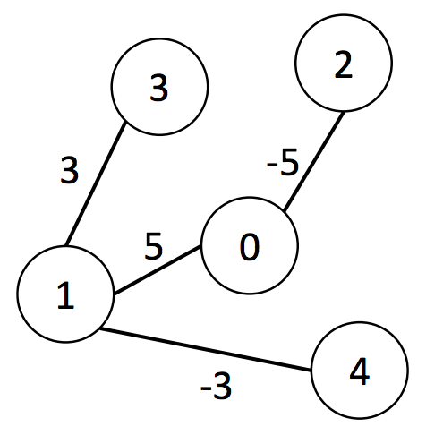

## 문제

The year is BE 2600 and the world is on a major war. Money and resource are much need in every part of the world and our country is one among them. A very common and fast way to gain money in the time of war is to issue financial bond.

In our country, there are N towns (2 ≤ N ≤ 100,000). Each town has roads connecting them. We can travel from any town to any town using these roads. It is guaranteed that there are exactly one route that we can travel between any pair of towns.

The government plan to have K parades to advertise this bond (10 ≤ K ≤ 100,000). The parade is numbered from 1 to K. The ith parade will start from the town Ai and travel to the town Bi. However, the advertisement will be done on the road only (this makes sense because people on the town have already spent all their money.) Because of the budget limitation, for each parade, we can actually advertise on one single consecutive sequence of road only. For example, if the parade follow the route A  B  C  D route (from A to D), it is possible that this parade may advertise on all the road from A to D. It is also possible to advertise on the road from B to C but the parade cannot choose to advertise one time on the road from A to B and another time on the road from C to D, i.e., it cannot skip the road from B to C. A parade may choose to not advertise on any road at all.

From a survey, we know that doing advertisement on the road i will contribute wi to the total value of bond sale (-10,000 ≤ wi ≤ 10,000). Be noted that it is possible that wi is negative, i.e., advertising on that road will decrease the total sale. We want to know the maximum value of sales

Write a program to calculate the maximum value of sales

## 입력

The first line of input contains a number T (1 ≤ t ≤ 20) that gives the number of test case. Each test case are given in the following format.

* The first line contains two integers N and K that represent the number of town and the number of road respectively.
* The following (N-1) lines. Each line contains three integers ai bi wi (0 ≤ ai, bi < N) that indicates that the ith road connect the town ai bi and the benefit of advertising on this road
* The following K lines. Each line contains two integers Ai Bi that represents the path of the parade.

## 출력

For each test case, output K lines each line gives the maximum sales of each parade.

## 힌트

For the first test case, the road is as follow

