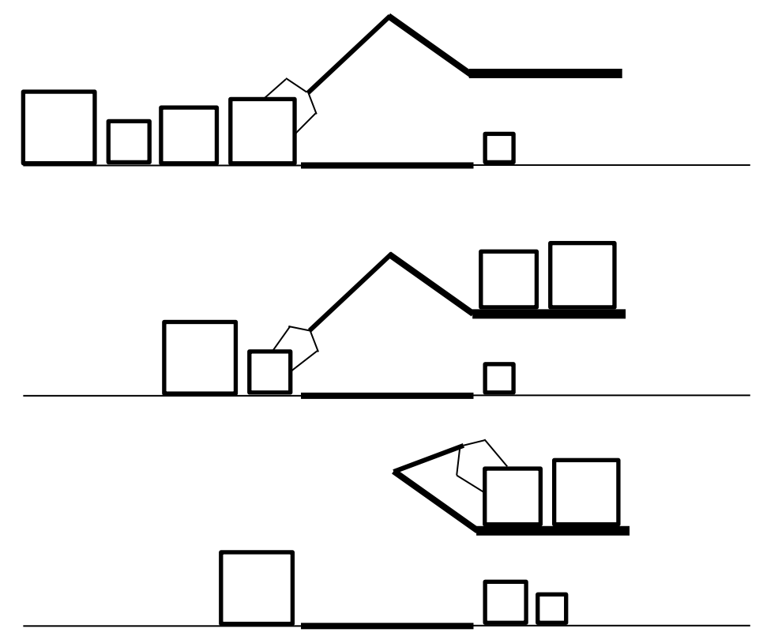

## 문제

Your chicken farm would like to send eggs to the market. Each package has different sizes, so you need to take care how you pack them. You decide to pack the egg packages vertically and sort them from the shortest to tallest.

Your farm uses the hydraulic arm system and the arm can do one of these three actions at a time.

1. Move the right-most egg package from the left conveyor belt and place at the left-most position of the upper shelf
2. Move the left-most egg package on the upper shelf to the left-most position of the right conveyor belt.
3. Move the right-most egg package from the left conveyor belt to the left-most position of the right conveyor belt.

For the speed of the process, the arm cannot move any package on the right conveyor belt.

Write the program to check if the given position of the package can be process to the desire position, all package on the right conveyor belt, sorted from smallest on the right and tallest on the left.

## 입력

The first lint contain integer T (1 ≤ T ≤ 20), the number of testcases. In each testcase there will be as follow.

The first line contains integer N (1 ≤ N ≤ 10,000), the number of egg packages.

Next line contains positive integer a1, a2, a3, …, aN (1 ≤ ai ≤ N), the height of the egg packages from left to right of the left conveyor belt. There will not be two packages that have the same height.

## 출력

For each testcase, print “yes” or “no” on the following condition.

* “yes” if there is a way to process the given position to the desire position
* “no” if you cannot find a way to do it.
  + (please notice that “yes” and “no” is in lowercase.)
