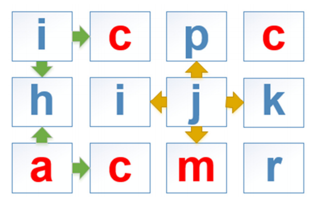

## 문제

John Corner demands to generate words from his alphabet table. Each word is composed by traveling of alphabets in four directions (← le\*, ↑ up, → right, and ↓ down), star/ng from first alphabet (‘i’) un/l last alphabet (‘r’). When all words have been created, he would like to know how many words he has. Of course, it is possible to have some duplicated words and he also needs to know how many unique words he got. Please help him to finish these funny tasks.

**Moving step explanation:**

From the Figure above presented alphabet table that has the 3 row x 4 column.

Case: word length = 1,

Regarding to the alphabet table, take each alphabet starting from ‘i’ (top-left) to ‘r’ (rightdown), then there are 12 result words (i c p c h i j k a c m r). Length =1, one alphabet means one word. In this case, there is no traveling in four directions (← ↑ → ↓) since the word is ended by the length (length = 1).

Case: word length = 2,

Take ‘i’ (top-left corner) from the alphabet table. ‘i’ cannot move left or up since there is no adjacent alphabets. ‘i’ can only move right and move down. Then, let move ‘i' to the right, the word will be “ic”. Let move ‘i’ down, the word will be “ih”.

Next step, take another adjacent alphabet ‘c’. ‘c’ can move in ordered left, right and down. The words will be “ci, cp, ci”. He repeats these steps until reaching the last alphabet (‘r’).

Case: word length = 3,

Use the previous travel steps. Thus, let move ‘i’ to the right, the word will be “ic”. (length = 2).

Then, continue to move for the word with length = 3

* move left (from ‘c’) to the last alphabet back to itself. “ic” -> ‘i’.
* CANNOT move up. (There is no an adjacent alphabet above)
* move right (from ‘c’) “ic” -> ‘p’
* move down (from ‘c’) “ic” -> ‘i’

Then, all summarized words starting from the first alphabet will be “ici”, “icp”, “ici”, …. , then, repeat until reaching the last alphabet (‘r’)

**Alphabet traveling restriction:**

John has been participated ACM ICPC Thailand and he loves it very much. Therefore, he prefers to define “acm” as **THREE** forbidden alphabets. Any word contains any forbidden alphabets (‘a’ OR ‘c’ OR ‘m’ ***LOWERCASE only***) will be discarded (examples: ici, ahi, and mrk will be rejected)

**Remark:** When he moves an alphabet to another alphabet, it can be moved back to a previous selected alphabet if it still satisfies the policy (moving four directions, word lengths and forbidden alphabets).

Since John applies the moving steps including his traveling restriction, the generated words will be minor changed as illustrated in these 3 examples:

## 입력

The first line of input contains three unsigned integers: the row “R” (0 < R < 11), the column “C” (0 < C < 11) of the alphabet table and the word length “L” (0 < L < 7) consecutively.

The following R lines represent the alphabet table. Each line is a row containing C characters without space. All given characters are smaller letters.

## 출력

The first line is an integer calculated from the number of generated words with the length of L, and the second line is an integer calculated from the number of unique words of all words generated.

## 힌트

**Example 1**

The result words (length=1):

```

b c
d e f
h i j
```

All words = 7 (‘a’ does not count as a forbidden alphabet) and unique words = 7 (no duplication).

**Example 2**

The result words (length=2):

```

ih pj
hi hi ih ij ji jp jk kj kr
rk
```

All words = 12 and unique words = 10 (“hi”: 2 duplicated words and “ih”: 2 duplicated words)

**Example 3**

The result words (length=3):

```

bob box boo btb btb bto bti obo obt oxo
oxy oot ooo ooy oot xob xox xoo xyo xyx
btb btb bto bti bgb bgi tbt tbg tbo tbt
tot too toy tot tig tit tit tie otb otb
oto oti oob oox ooo oyo oyx oti oto otu
yot yoo yoy yot yxo yxy
gbt gbg gig git git gie igb igi itb itb
ito iti iti ito itu iei ieu tig tit tit
tie tot too toy tot tue tut tui
eig eit eit eie eue eut eui uei ueu uti
uto utu uiu iue iut iui
```

All words = 100 and unique words = 73.
