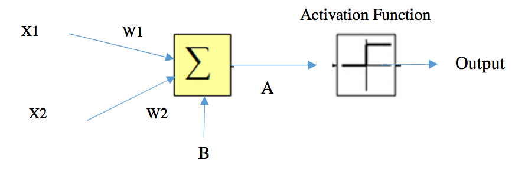

## 문제

Neural Networks (NNs) is a machine learning technique that is widely used in real world applications. Neural Networks can be applied to various types of problems, such as classification, prediction and so on. We need to understand the fundamental of the technique first in order to apply the technique to the problem. The figure below shows a simple neural network (neuron node) that consists of two inputs, X1 and X2. And, the output is transformed by the Activation Function. Weight values, W1 and W2, are associated with the input in the network, and these values constrain how input data are related to the output data. That is each input has its own weight, which is adjustable. Bias value (B) allows the network to shift the Activation Function to be active or not. Bias value is also another one value that can adjust the network. Weight and Bias are the key values to build the neural network match with their function.

In this network, we use a step function: if A >= 0, Output is 1 otherwise 0, where A is the summation of the weighted input and the bias. In this case, A = X1W1 + X2W2 + B.

Figure 1. Neuron Node

A Machine Learning class assigns its first homework to its students to design neural networks that estimate logical AND and logical OR properly.

As a teaching assistance of this class, you have to write the program to verify the set of neural networks from the student’s submission whether each of which can work correctly as two logical functions, a logical AND and a logical OR.

## 입력

The input will start with an integer T (1< T < 200), the number of test cases. Each of the test cases starts with one word and three integers. The word means type of logical function. The first integer and the second integer, W1 and W2, are the weight values of the network (-2.5 <= W1, W2 <= 2.5). The last integer is the bias value (-5<=B<=5).

## 출력

For each line of input produce one line of output. This line contains a string “true” or “false” (without the quotes), which denotes the results of whether a simple neural network is correct or not. Look at the output for sample input for details. (Hint: The output “true” is equivalent to 1 and “false” is equivalent to 0)
