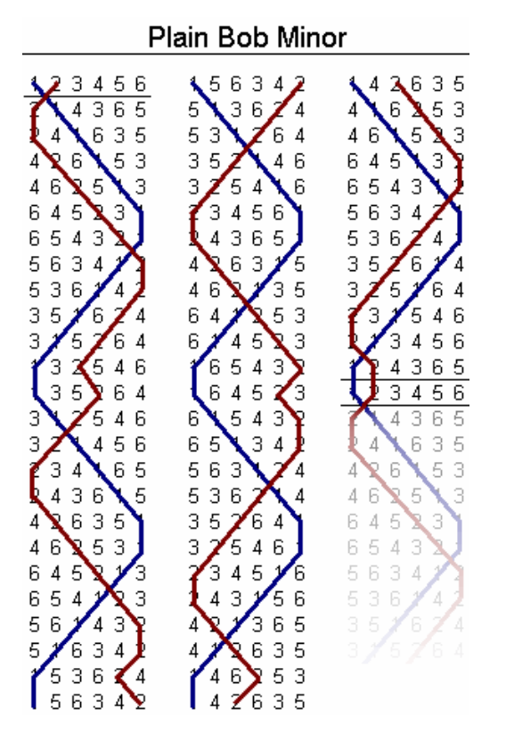

## 문제

Method ringing is used to ring bells in churches, particularly in England. Suppose there are 6 bells that have 6 different pitches. We assign the number 1 to the bell highest in pitch, 2 to the second highest, and so on. When the 6 bells are rung in some order—each of them exactly once—it is called a row. For example, 1, 2, 3, 4, 5, 6 and 6, 3, 2, 4, 1, 5 are two different rows.

An ideal performance contains all possible rows, each played exactly once. Unfortunately, the laws of physics place a limitation on any two consecutive rows; when a bell is rung, it has considerable inertia and the ringer has only a limited ability to accelerate or retard its cycle. Therefore, the position of each bell can change by at most one between two consecutive rows.

In Figure B.1, you can see the pattern of a non-ideal performance, where bells only change position by at most one.

Figure B.1: A non-ideal performance respecting the inertia of bells. The trajectory of bell number 1 is marked with a blue line and trajectory of bell number 2 marked with a brown line.

Given n, the number of bells, output an ideal performance. All possible rows must be present exactly once, and the first row should be 1, 2, . . . , n.

## 입력

The first and only line of input contains an integer n such that 1 ≤ n ≤ 8.

## 출력

Output an ideal sequence of rows, each on a separate line. The first line should contain the row 1, 2, . . . , n and each two consecutive lines should be at most 1 step away from each other. Each row should occur exactly once in the output.
