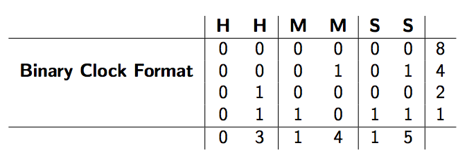

## 문제

Margaret has always been a good maths student. She has been trying to apply the principles of binary quantum refraction to time travel in her free time. By encoding time in a binary format and adding a non negative time difference, δ, she is hoping to create a singularity in the fabric of space and time allowing one to jump by the amount δ into the future.

Time’s usual representation is the well known 24h format - e.g. 03:14:15. Although there is several possible ways to represent time in a binary form, the convention used throughout this exercise is as follows.

Figure 1: Binary Clock Format of time 03:14:15.

A 4 × 6 matrix can be used to represent time in a binary format. Each decimal digit of the 24h format is encoded separately using 4 bits. The decimal digits are encoded in binary with the most significant bit on top, and the least significant at the bottom. For instance, the decimal number 310 can be represented as 00112 in a 4-digit binary format, i.e. (0 × 23) + (0 × 22) + (1 × 21) + (1 × 20) = 3.

Provided a time of day T and a time difference δ, both in the Binary Clock format, you are to compute the time of day resulting from their summation, i.e. T + δ.

## 입력

The first 4 lines represent the time of day and the subsequent 4 lines represent the time delta. Both clocks are guaranteed to be a valid time ranging from 00:00:00 to 23:59:59 inclusively. We further assume a naive implementation of time in which we do not care about time zones, leap seconds, nor the shifting effects of daylight saving time.

## 출력

The output should consist of the resulting time (T +δ) in the 4×6 matrix Binary Clock format. This should immediately be followed by a newline.
