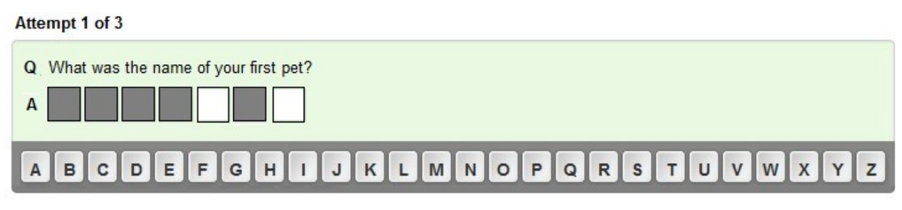

## 문제

Keepsafe is a tool used by KiwiBank to “provide an extra layer of security to help protect customers while using Kiwibank Internet Banking.” Customers have to set up a number of security questions and answers. After logging in with a user name and password, a customer is presented with one of their security questions and a space for the answer. Two letters in the answer have to be entered as shown by white boxes. For example:

If the pet's name was “Whisper”, the customer would press the P key then the R key. The letters pressed must correspond, in order, to the two spaces in the outline answer to the security question.

For this problem, you have to check customers' answers and verify that they are as expected.

## 입력

The first line of input contains a single integer, C (0 < C <= 50), which is the number of customers you have to process.

The data for each customer begins with a line containing a single integer, A (2 < A < 10), which is the number of security answers provided. Each answer consists of upper case letters and spaces only, with between 5 and 32 characters. The first answer is to security question 1 and so on.

The next line contains a single integer, L (0 < L <= 50), which is the number of login attempts you must process. A login attempt consists of 3 positive integers followed by 2 upper case letters, all separated by single spaces. The first integer is the number of the security answer required. The second and third integers are numbers of the characters required to fill the two spaces in the outlined answer. They are presented in ascending order. When numbering characters in the answer, the first character is 1, but only letters are assigned numbers, spaces being ignored. The two letters are those entered by the customer into the two spaces. They are expected to correspond to the letters in the appropriate places in the security answer required.

The 3 digits will all be valid ie between 1 and the maximum value possible in each case.

## 출력

For each customer in the input, output begins with a line containing the text Customer N, where N is 1 for the first customer and so on, customers being numbered in the order they appear in the input.

For each transaction for that customer, output one line which says either correct or error. If the two letters entered match the letters in the required places in the answer, in the order presented, then the output will be correct. If one or both letters are not correct, the output is error.
