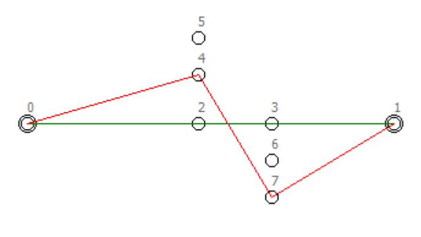

## 문제

It is nearly time for the annual NZPC (New Zealand Pond Competition). Frogs from around the country gather to compete at jumping from lily pad to lily pad across competition ponds. The competition is about speed and style. As the time taken per jump is essentially independent of jump distance, speed can be maximised by following paths which involve the smallest number of jumps. Style is about taking only large jumps. Nothing looks worse than a finely trained competition frog taking a short jump. Freddo, last year’s champion, has asked you to write a program which, given a lily pad placement map and knowledge of a frog’s maximum jump range as input, will determine a best path for that frog to follow from start pad to finish pad.

The best path has a minimum number of hops – for example, every 3 hop path is better than any 4 hop path. Having found the minimum number of hops for a given pond, we must choose the best of the minimum hop paths. Of all minimum hop paths the best one is the one with the largest value for its shortest hop.

Consider the following pond layout. (This is the layout given in sample input, so numeric details are available there.) Pads 0 and 1 are the start and end respectively. Note that the path 0, 2, 3, 1 is the shortest path, but that it involves a particularly short jump from pad 2 to pad 3. The best competition path for this layout turns out to be 0, 4, 7, 1.

## 입력

Input consists of a sequence of problems. For each problem the first line of input holds two integers P and D. P is the number of lily pads on the pond and D is the maximum distance that the frog can jump. Following are P lines, one for each lily pad, each with two floating point numbers X and Y being the coordinates of the centre of the pad. (0 < D,X,Y < 1000, 2 <= P <= 200) Note that all jumps are from centre to centre – an off centre launch or landing leads to immediate disqualification. The first two pads in the input for each problem are the starting and ending pads for the competition respectively. Input is terminated with a P D line of 0 0.

## 출력

For each problem, output one line showing the number of hops required and the length of the shortest hop in the best path – this value should be rounded and displayed to exactly one decimal places. The two numbers should be separated by a single space. Note that the problems have been checked to ensure that the optimum result will round cleanly. Note also that the best path might not be unique. In that case, output the values from any best path.
