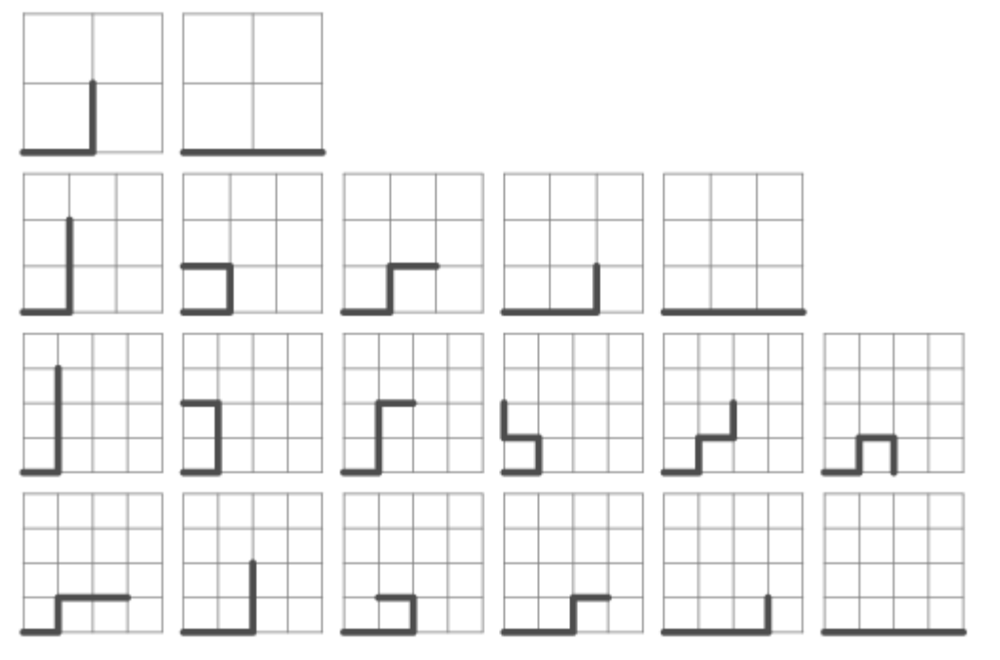

## 문제

Consider points with integer coordinates in the plane. We start from the origin, make a first step towards the point (1, 0) and then every next step is a move to one of the four neighboring integer points (up, down, left or right) so that we are always at a point with nonnegative coordinates. Moreover, it is not allowed to visit twice a point. Let us count how many different routes of the described kind we may obtain using n steps. For example, when n = 2, 3 and 4, counting the routes gives 2, 5 and 12, respectively.

Write program avoider that inputs two positive integers a and b (0 < a < b < 29) and displays the sum of counting the number of routes for values of n = a, a + 1, ..., b.

## 입력

Two positive integers a and b (0 < a < b < 29)

## 출력

The sum of counting the number of routes for values of n = a, a + 1, ..., b.
