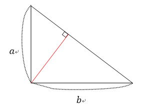

## 문제

엘리가 좋아하는 과자는 직각삼각형 모양이고, 빗변을 제외한 다른 두 변의 길이가 각각 a와 b이다. 어느 날 엘리는 이 과자를 많이 많이 먹을 수 있는 방법을 떠올리고 자신의 천재성에 전율했다.

엘리는 빗변의 양 끝점이 아닌 점에서 빗변으로 과자를 자르면 직각삼각형 두 개를 만들 수 있다는 것을 알았다! 사실 이렇게 잘라봐야 과자의 총 면적은 같지만, 어린 엘리는 과자가 두 개가 되었다는 사실이 너무 행복했고 이런 방법을 떠올린 자신이 너무 기특했다. 그리고 또 생각했다. 직각삼각형 모양 과자가 두 개가 되었으니까 이 두 개를 아까처럼 자르면 직각삼각형 모양 과자가 네 개… 여덟 개… 2N개! 즉 엘리가 하나의 직각삼각형 모양 과자를 가지고 시작해서 자신이 가진 모든 과자를 잘라 과자의 개수를 두 배로 불리는 것을 N번 반복하면 엘리가 가진 직각삼각형 모양 과자의 개수는 2N개가 되는 것이다! 이렇게 자르는 것은 엘리가 가진 놀라운 힘을 이용하면 간단한 것이었고, 엘리는 이미 이런 식으로 과자들을 자르는 행위를 N번 반복해 2N개의 조각을 가지고 있다.

엘리는 이 과자들을 모두 먹고 싶었지만 모두 먹기에는 너무 조각이 많다고 생각해서 2N개의 조각들 중 크기(=면적)가 K번째로 큰 한 조각은 바보 피터에게 주기로 했다. 피터가 받게 될 과자의 면적이 얼마지 구하는 프로그램을 작성하라.

## 입력

첫 번째 줄에 네 개의 자연수 a, b, N, K (1 ≤ a, b ≤ 100, 1 ≤ N ≤ 40, 1 ≤ K ≤ 2N)이 공백을 사이로 두고 주어진다.

## 출력

첫 번째 줄에 피터가 받게 될 과자의 크기(=면적)를 출력한다. 다만 이 값이 너무 작을 수 있으므로, 면적에 자연 로그(\(\ln{}\))을 취한 값을 출력한다. (즉 면적이 S라면, \(\ln{S}\)의 값을 출력해야 한다.) math.h 또는 cmath 헤더에 있는 log 함수([레퍼런스](./001_log))가 자연 로그를 계산하는 함수이다.

출제진이 의도한 정답과의 절대 오차 또는 상대 오차가 10-8 이하이면 올바른 답안으로 인정한다. 비교는 여러분이 출력한 값, 즉 면적에 자연로그를 취한 값을 기준으로 이루어진다.
