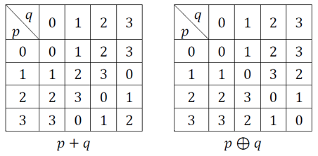

## 문제

경근이는 새로운 컴퓨터를 발명했다. 이 컴퓨터는 다른 컴퓨터들과는 달리 이진법이 아닌 사진법으로 자료를 저장한다.

이 컴퓨터에서 p + q의 연산 결과와 p ⊕ q의 연산 결과를 표로 나타내면 아래와 같다.

경근이는 자신이 발명한 컴퓨터가 너무나 혁신적이라고 생각하여, 이를 한시라도 빨리 사용해 보고 싶은 마음에 컴퓨터를 직접 만들었다!

이 컴퓨터는 아주 적은 예산을 들여 임시로 만든 것이기 때문에, N개의 변수만 저장할 수 있으며, 각 변수는 0 이상 3 이하의 정수 하나만 저장할 수 있다. 경근이는 편의상 각 변수에 0 이상 N - 1 이하의 번호를 붙였고, i번 변수를 vi로 부르기로 했다.

경근이는 시간과 정성을 들여 꼭 필요하다고 판단한 4가지 기본 명령을 만들었다.

* `addv x y z` (0 ≤ x, y, z ≤ N - 1, x, y, z의 값은 모두 정수): vx에 vy + vz의 값을 대입한다.
* `xorv x y z` (0 ≤ x, y, z ≤ N - 1, x, y, z의 값은 모두 정수): vx에 vy ⊕ vz의 값을 대입한다.
* `addc x y z` (0 ≤ x, y ≤ N - 1, 0 ≤ z ≤ 3, x, y, z의 값은 모두 정수): vx에 vy + z의 값을 대입한다.
* `xorc x y z` (0 ≤ x, y ≤ N - 1, 0 ≤ z ≤ 3, x, y, z의 값은 모두 정수): vx에 vy ⊕ z의 값을 대입한다.

경근이는 M개의 기본 명령을 나열한 코드를 작성했다. 코드를 컴파일하면 프로그램이 생성되는데, 이 프로그램은 명령을 실행하기 전 각 변수 vi에 저장할 값을 입력받아, 코드에 있는 M개의 명령을 하나씩 하나씩 순서대로 실행하고, 모든 명령을 실행한 이후 각 변수 vi에 저장되어 있는 값을 출력한다. 편의상 입력을 a0, a1, ..., aN-1로, 출력을 b0, b1, ..., bN-1로 나타내자.

아쉽게도, 경근이의 구현 실수로 인해, 모든 변수 vi에는 초기에 저장될 수 없는 값인 fi (0 ≤ fi ≤ 3)이 존재한다. 따라서 ai ≠ fi여야 하므로, ai로 가능한 값은 0, 1, 2, 3 중 fi가 아닌 수들이다. 그러므로 가능한 모든 입력의 수는 3N가지임을 알 수 있다.

경근이는 완벽한 프로그램을 작성했는지 알고자 모든 가능한 입력들을 고려해 보기로 한다. 경근이는 결과를 기록하기 위해 N페이지로 구성된 노트를 구매했으며, 각 페이지에 0 이상 N - 1 이하의 정수 번호를 붙였다. 경근이는 가능한 모든 입력을 만들어 이를 모두 한번씩 프로그램에 넣어 보면서, 각 입력에 대한 프로그램의 출력 b0, b1, ..., bN-1을 얻은 후, bi의 값을 i번 페이지에 적는 일을 할 것이다.

모든 입력을 고려한 이후, i번 페이지에 적혀 있는 수들의 합을 si라고 하자. 경근이는 작업을 시작하기 전, 최소한의 안전 장치를 마련하고자 모든 i에 대해 si를 4로 나눈 나머지를 알고자 한다.

## 입력

첫 번째 줄에 변수의 수 N (1 ≤ N ≤ 18)과 명령의 수 M (0 ≤ M ≤ 400)이 주어진다.

두 번째 줄에는 f0, f1, ..., fN-1 (0 ≤ fi ≤ 3)이 공백을 사이로 두고 주어진다. 여기서 fi는 명령을 실행하기 전 변수 vi에 저장될 수 없는 값이며, 정수이다.

이후 M개의 줄에 명령들이 실행되는 순서대로 한 줄에 하나씩 주어진다. 이 중 j (1 ≤ j ≤ M)번째 줄의 입력 형식은 다음과 같으며, 주어지는 모든 수는 정수이며, 공백 하나로 구분된다.

* "0 x y z" (0 ≤ x, y, z ≤ N - 1): j번째로 실행되는 명령이 `addv x y z`임을 나타낸다.
* "1 x y z" (0 ≤ x, y, z ≤ N - 1): j번째로 실행되는 명령이 `xorv x y z`임을 나타낸다.
* "2 x y z" (0 ≤ x, y ≤ N - 1, 0 ≤ z ≤ 3): j번째로 실행되는 명령이 `addc x y z`임을 나타낸다.
* "3 x y z" (0 ≤ x, y ≤ N - 1, 0 ≤ z ≤ 3): j번째로 실행되는 명령이 `xorc x y z`임을 나타낸다.

## 출력

si를 4로 나눈 나머지를 ti라고 할 때, 첫 번째 줄에 t0, t1, ..., tN-1을 공백을 사이로 두고 출력한다.
