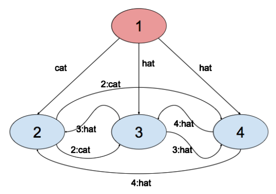
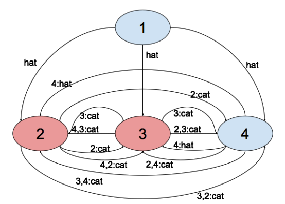

## 문제

A group of N friends are playing a word-by-mouth game, where one friend (the leader) starts saying a word (either ‘hat’ or ‘cat’) to each of the other friends. m of the N friends pronounce the words incorrectly such that instead of ‘hat’ a listening friend may understand ‘cat’. For simplicity we assume that such a friend will always say ‘cat’ to his other friends, no matter what another friend said to him. The leader may also have problems pronouncing, in which case he will say different things to each friend.

In order to try to reach a consensus, so that each friend recovers the same message, they try the following Word By Mouth algorithm WBM(m):

Algorithm WBM(m), m > 0

1. The leader sends his word to every other friend.
2. For each friend i, let vi be value that friend i receives from the leader. Then, friend i acts as the leader in Algorithm WBM(m-1) to send the value vi to each of the other friends. A message originated from friend i cannot reach i again.
3. For each i and j≠i, let vj be the value that friend i received from friend j in step (2) using Algorithm WBM(m-1). Then friend i uses as his value the majority of the values (v1, v2, …, vN-1). In case of equality of values, the friends decide for ‘cat’.

Algorithm WBM(0)

1. The leader sends his word to very other friend
2. Each friend uses the word received from the leader

The game starts by the leader running the algorithm WBM(m).

The following examples show how the friends play in different scenarios. Except from the messages sent by the leader, each time a friend sends a message, he adds his ID to the message, so that the receiver knows which path the message came from.

Example 1:

As shown in Figure 1, there are N=4 friends with the leader transmitting the word cat to friend 2 but the word hat to friends 3 and 4. Friend 2 receives the following: cat (from 1), hat (from 3), hat (from 4). He decides for hat. Friend 3 receives the words: hat (from 1), cat (from 2), hat (from 4). He decides for hat. Friend 4 receives the words: hat (from 1), cat (from 2), hat (from 3). He decides for hat. All the N-1 friends (excluding the leader) decide for the same word, hat, even though the leader sent different words to each friend.

Fig. 2 N=4 friends with leader i=1 sending an incorrect word.

Fig. 2 N=4 friends with friends i=2 and i=3 sending an incorrect word.

Example 2:

In Figure 2, we have again N=4 friends but m=2 of them send incorrect words. We see that in this case there are more messages being exchanged. Friend 2 sends cat to friend 3 and then friend 3 forwards this to friend 4 (shown by ‘2,3:cat’ in the figure). Friend 2 also sends the message cat directly to friend 4 (shown by ‘2:cat’ in the figure). Therefore, friend 4 receives the messages cat (directly, '2:cat') and cat (indirectly, '2,3:cat') from friend 2 and decides that friend 2 said cat. Similarly, friend 4 receives from friend 3 the words cat (directly) and cat (indirectly, ‘3,2:cat’) and decides that friend 3 said cat. Friend 4 received hat from the leader. In the end, friend 4 decides for the word cat, which is the majority (friends 2 and 3 said cat, friend 1 said hat).

Your task is to determine the words decided by the friends that do not confuse the words, excluding the leader. If the leader pronounces correctly, then there are N-m-1 such friends (friend 4, in example 2), else there are N-m such friends (friends 2, 3 and 4, in example 1).

## 입력

The first line contains the numbers N (2<N<101) and m (0<m<8). The second line contains m positive integer numbers, representing the IDs of the friends that will modify the messages (the leader always has ID=1). The following N-1 lines contain the word (‘cat’ or ‘hat’) that the leader (i=1) sends to each of the other N-1 friends.

## 출력

On the output you should put N-m-1 (if the leader pronounces correctly) or N-m (if the leader can pronounce incorrectly) words (‘cat’ or ‘hat’), one per line, representing the words understood by the friends that pronounce correctly (this excludes the leader).
