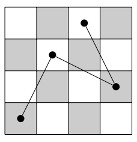
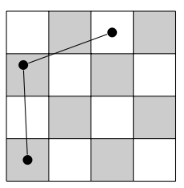

## 문제

The land of the Black King is an infinitely stretching flat surface neatly divided into black and white squares, much like an infinite chessboard. The area of every square is exactly one square metre, and the squares are neatly layed out on a perfect grid. Sir Jumpsalot is a knight who lives in the land of the Black King. By law, knights may only move around by jumping from the centre of a square to the centre of another square, as long as the distance between those centres is exactly √D metres. (In the game of chess, the value of D is fixed at 5, but we will consider other values of D as well.) The value of D fixed in the law can be written as a sum of two squares, for otherwise knights would be unable to move around.

Sir Jumpsalot doesn’t like to play by the rules. While he still moves around by jumping √D metres, he doesn’t bother landing on the centre of a square every time. In other words, he sometimes lands in a corner of a square or even on the border between adjacent squares, whichever is most convenient. Reaching his destination is usually easier this way, as can be seen from the following example (travelling two squares horizontally and three vertically with the familiar value of D = 5).

a) Route for any normal, law abiding knight.

b) Route for the cheating Sir Jumpsalot.

Given that Sir Jumpsalot starts at the centre of the square with coordinates (0, 0) and has to travel to the centre of the square with coordinates (X, Y ), your task is to calculate the minimum number of jumps Sir Jumpsalot needs to reach his destination. You may safely assume that there are no obstructions in his way.

## 입력

The input starts with a line containing an integer T, the number of test cases. Then for each test case:

* One line with three space-separated integers D, X and Y , denoting (the square of) the distance jumped in a single jump and the coordinates of the final destination. These satisfy 1 ≤ D ≤ 108 and −104 ≤ X, Y ≤ 104. It is guaranteed that D can be written as the sum of two squares.

## 출력

For each test case, output one line with a single integer J, the minimum number of jumps needed to reach the destination.
