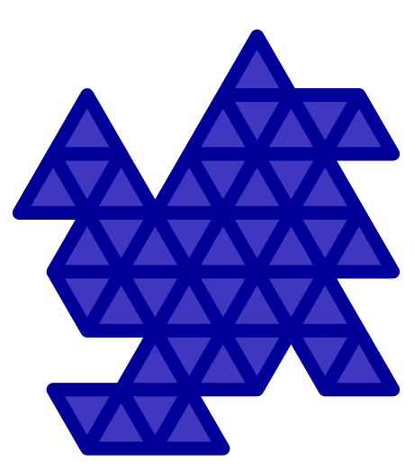
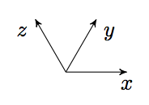
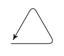

## 문제

At the Colby’s Costly Collectibles workshop, special jewels are manufactured. In his production process Colby first creates a large grid of stones, each of which has the shape of an equilateral triangle. From this grid he cuts out all kinds of shapes which he sells as pieces of jewellery. Customers can choose their preferred shape according to the following basic rules:

1. Cuts can only be made along the edges of the triangles.
2. The jewel must consist of one piece. A connection at a vertex is too weak, so the triangles must be connected by their edges.
3. The jewel cannot contain any holes.

To illustrate the production process, a typical jewel is depicted in the figure on the right. This corresponds with the third test case in the samples below.

Since the customer has to pay per triangle, Colby has asked you to help him calculate the number of triangles used. You are given a description of the jewel’s outer boundary. Note that it follows from rules 2 and 3 that the boundary will never intersect or touch itself.

## 입력

The input starts with a line containing an integer T, the number of test cases. Then for each test case:

* One line with a single integer C, the number of cuts made. This number satisfies 3 ≤ C ≤ 100.
* Then C lines follow, describing the boundary of the jewel in counterclockwise orientation. Each line starts with a single letter x, y or z, denoting the direction in which to move, followed by an integer denoting the number of steps. The directions correspond with the axes depicted below:  
    
  To further illustrate this, the first test case below describes a single triangle, starting from the lower left corner:  
    
  (First take one step in the x direction, then one step in the z direction and finally one step in the negative y direction.)

The boundary will never touch itself. It will always end up where it started and the total length of the boundary will not exceed 1000. The path starts at a vertex and the endpoint of every segment will again be a vertex. (In other words, no two consecutive edges in the input will be in the same direction, not even the first and the last edge.)

## 출력

For each test case, output one line with a single integer N, the number of triangles.
