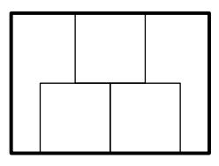
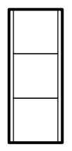

## 문제

Alex is fond of origami — Japanese art of paper folding. Most origami designs start with a square sheet of paper. Alex is going to make a present for his mother. Present’s design requires three equal square sheets of paper, but Alex has only one rectangular sheet. He is able to cut out squares of this sheet, but their sides should be parallel to the sides of the sheet. Help Alex to determine the maximum possible size of the paper squares he is able to cut out.

## 입력

The single line of the input file contains two integers h and w — the height and the width of the sheet of paper (1 ≤ h, w ≤ 1000).

## 출력

Output a single real number — the maximum possible length of the square side. It should be possible to cut out three such squares of h × w sheet of paper, so that their sides are parallel to the sides of the sheet.

Your answer should be precise up to three digits after the decimal point.

## 힌트

Example 1

Example 2
