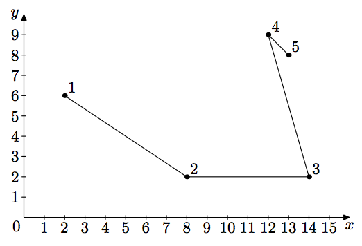
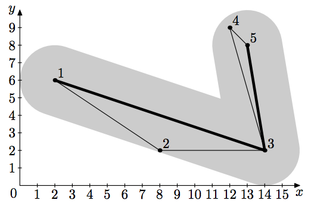

## 문제

Once upon a time, there was a kingdom ruled by a wise king. After forty three years of his reign, by means of successful military actions and skillful diplomacy, the kingdom became an infinite flat two-dimensional surface. This form of the kingdom greatly simplified travelling, as there were no borders.

A big holiday was planned in the kingdom. There were n locations for people to gather. As the king wanted to have a closer look at his people, he ordered to make a trip through these locations. He wanted to give a speech in each of these locations. Initially his trip was designed as a polygonal chain p: p1 → p2 → . . . → pn.

Not only the king was wise, but he was old, too. Therefore, his assistants came up with an idea to skip some locations, to make the king to give as few speeches as possible. The new plan of the trip has to be a polygonal chain consisting of some subsequence of p: starting at p1 and ending at pn, formally, pi1 → pi2 → · · · → pim, where 1 = i1 < i2 < · · · < im = n. Assistants know that the king wouldn’t allow to skip location j, if the distance from pj to segment pik → pik+1 exceeds d, for such k, that ik < j < ik+1.

Original route

New route

Help the assistants to find the new route that contains the minimum possible number of locations.

## 입력

The first line of the input file contains two integers n and d — the number of locations in the initial plan of the trip and the maximum allowed distance to skipped locations (2 ≤ n ≤ 2000; 1 ≤ d ≤ 106).

The following n lines describe the trip. The i-th of these lines contains two integers xi and yi — coordinates of point pi. The absolute value of coordinates does not exceed 106. No two points coincide.

## 출력

Output the minimum number of locations the king will visit. It is guaranteed that the answer is the same for d ± 10−4.
