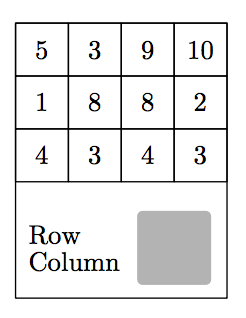
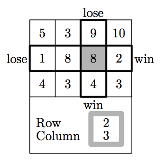
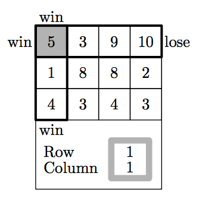

## 문제

Lucky Chances is a lottery game. Each lottery ticket has a play field and a scratch area. The play field is a rectangular r × c field filled with numbers. The scratch area hides row and column numbers that specify the bet cell.

There are four possible winning directions: up, down, left and right. You win a direction if all numbers in this direction from the bet cell are strictly less than a number in the bet cell. And if the bet cell is on the edge of the grid, you win the corresponding direction automatically!

Unscratched ticket

Scratched ticket 1

Scratched ticket 2

Larry wants to choose the ticket that has maximum total number of winning directions for all possible bet cells. Write a program that determines this number for the given grid.

## 입력

The first line of the input file contains two integers r and c — the number of rows and columns in the grid (1 ≤ r, c ≤ 100).

The following r lines contain c integers each — the numbers printed on the grid. Each number is positive and does not exceed 1000.

## 출력

Output a single integer w — the total number of winning directions for the given grid.
