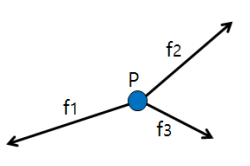
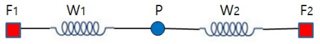
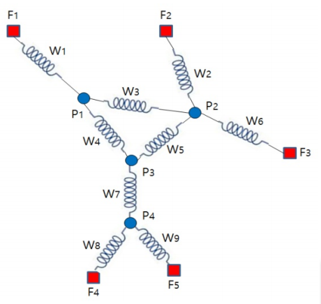

## 문제

When the sum of forces exerted on an object, say P, is 0 as shown in Figure 1, the object will not move. It is said that the object is in an equilibrium state.

Figure 1. Forces exerted on object P

Suppose a situation as shown in Figure 2. There are two fixed points F1 and F2 on the x-axis. Object P is connected by two springs S1 and S2. Spring S1 connects F1 and P and spring S2 connects F2 and P. Let’s denote w1 and w2 to be the elastic coefficients of springs S1 and S2, respectively, which denote how stiff the springs are. Let’s also denote x(F1) and x(F2) to be the x-coordinates of F1 and F2, respectively. Then the force exerted on P by S1 is w1 × (x(P) − x(F1)) by Hooke’s rule, where x(P) is the x-coordinate of P. Similarly, the force exerted on P by S2 is w2 × (x(P) − x(F2)).

Figure 2. An example to illustrate an equilibrium state

For example, in a situation as shown in Figure 2, if x(F1) = 0, x(F2) = 7, w1 = 3, w2 = 4, and P is in an equilibrium state, then we can determine the location of P, i.e., x(P) = 4.

Consider a similar situation where several objects are connected by multiple springs in a two-dimensional plane as shown in Figure 3. Assume there are k fixed points F1, … , Fk and m objects S1, … , Sm. Also, assume there are 5 springs w1, … , wm with elastic coefficients w1, …, wm, respectively. Each of the springs is used to connect either a fixed point and an object or two objects. If every object is connected to at least two springs, then all the objects will finally get into an equilibrium state. Once all the objects get into an equilibrium state, we can determine the location of every object in the plane.

You are asked to make a program to determine the locations of 6 objects in an equilibrium state using given information: the locations of k fixed points, the elastic coefficients of m springs, and the interconnection information between objects and fixed points.

Figure 3. Another example to illustrate an equilibrium state in the plane

You can assume:

1. All objects are connected to at least two springs and any pair of objects and fixed points are connected through one or more springs.
2. There is at most one spring between either a pair of (object, object) or a pair of (object, fixed point).
3. There are at least three non-collinear fixed points.
4. When all objects are in an equilibrium state, no two springs will cross each other and no two objects will locate at the same position.
5. No two fixed points have the same coordinates.

## 입력

Your program is to read from standard input. The input consists of T test cases. The number of test cases T is given in the first line of the input. Each test case starts with a line containing three integers,  k (3 ≤ k ≤ 100), m (3 ≤ m ≤ 3,000), and n (1 ≤ n ≤ 1,000), where k is the number of fixed points, m is the number of springs, n is the number of objects. In the following k lines, each line contains the integer coordinate (xi, yi) (−10,000 ≤ xi, yi≤ 10,000) of fixed point Fi (1 ≤ i ≤ k). In the following m lines, each line contains three integers wi, ui, and vi (1 ≤ i ≤ m), where wi (1 ≤ wi ≤ 100) is the elastic coefficient of spring Si, and ui and vi are the indices of either a fixed point or objects which are connected to spring Si. If ui is negative then it means that fixed point F-ui (1 ≤ −ui ≤ k) is connected to spring Si. On the other hand, if ui is positive then it means that object Pui (1 ≤ ui ≤ n) is connected to spring Si. Similarity holds for vi.

## 출력

Your program is to write to standard output. For each test case, print first “Test case number : ” followed by the test case number as shown in the following sample. Then print number i (1 ≤ i ≤ n) starting from 1 to n followed by the coordinate (xi, yi) of object Pi in each of the following n lines. You print the coordinates of object Pi with two digits after decimal point after rounding off from the third digit. Three numbers (i, xi, yi) in each line should be separated by a blank. If each value of the coordinate is within an error range, 0.01, it will be considered correct.
